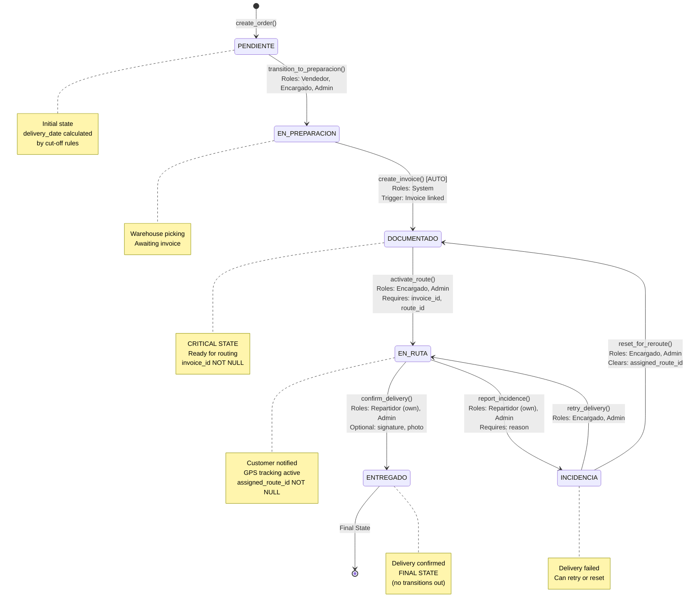
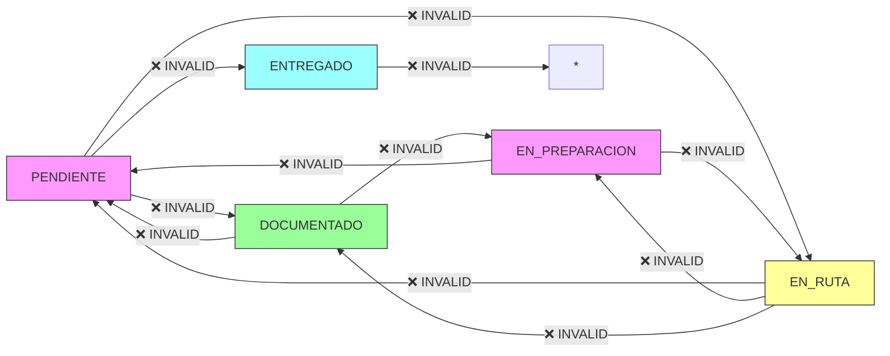

# BUSINESS RULES - CODE EXAMPLES & DIAGRAMS
## Sistema de Gestión de Despachos Logísticos

**Companion Document to:** BUSINESS_RULES_FORMAL_SPEC.md
**Version:** 1.0.0
**Date:** 2026-01-21

---

## Table of Contents

1. [Cut-off Time Examples](#1-cut-off-time-examples)
2. [State Transition Diagrams](#2-state-transition-diagrams)
3. [Permission Check Examples](#3-permission-check-examples)
4. [API Endpoint Examples](#4-api-endpoint-examples)
5. [Database Triggers & Constraints](#5-database-triggers--constraints)
6. [Testing Examples](#6-testing-examples)

---

## 1. Cut-off Time Examples

### 1.1. Complete CutoffService Implementation

```python
# app/services/cutoff_service.py

from datetime import datetime, date, time, timedelta
from zoneinfo import ZoneInfo
from typing import Optional

from app.models.models import User
from app.services.audit_service import AuditService
from app.models.enums import AuditResult


class BusinessDayService:
    """Helper service for business day calculations"""

    # Chilean holidays 2026 (update annually)
    CHILEAN_HOLIDAYS = {
        date(2026, 1, 1),   # Año Nuevo
        date(2026, 4, 3),   # Viernes Santo
        date(2026, 4, 4),   # Sábado Santo
        date(2026, 5, 1),   # Día del Trabajo
        date(2026, 5, 21),  # Glorias Navales
        date(2026, 6, 29),  # San Pedro y San Pablo
        date(2026, 7, 16),  # Virgen del Carmen
        date(2026, 8, 15),  # Asunción de la Virgen
        date(2026, 9, 18),  # Independencia
        date(2026, 9, 19),  # Glorias del Ejército
        date(2026, 10, 12), # Encuentro de Dos Mundos
        date(2026, 10, 31), # Día de las Iglesias Evangélicas
        date(2026, 11, 1),  # Todos los Santos
        date(2026, 12, 8),  # Inmaculada Concepción
        date(2026, 12, 25), # Navidad
    }

    @staticmethod
    def is_business_day(check_date: date) -> bool:
        """
        Check if date is a business day (Monday-Friday, not holiday)

        Args:
            check_date: Date to check

        Returns:
            bool: True if business day, False otherwise
        """
        # Saturday = 5, Sunday = 6
        if check_date.weekday() in [5, 6]:
            return False

        if check_date in BusinessDayService.CHILEAN_HOLIDAYS:
            return False

        return True

    @staticmethod
    def next_business_day(from_date: date) -> date:
        """
        Get next business day after given date

        Args:
            from_date: Starting date

        Returns:
            date: Next business day
        """
        next_date = from_date + timedelta(days=1)

        while not BusinessDayService.is_business_day(next_date):
            next_date = next_date + timedelta(days=1)

        return next_date


class CutoffService:
    """Service for cut-off time business rules (BR-001, BR-002, BR-003)"""

    TIMEZONE = ZoneInfo("America/Santiago")
    CUTOFF_AM = time(12, 0, 0)   # 12:00:00 PM
    CUTOFF_PM = time(15, 0, 0)   # 15:00:00 (3:00 PM)

    @staticmethod
    def calculate_delivery_date(
        order_created_at: datetime,
        user: User,
        override_date: Optional[date] = None,
        override_reason: Optional[str] = None
    ) -> date:
        """
        Calculate delivery date based on cut-off rules

        Business Rules:
        - BR-001: Orders <= 12:00:00 → same day (if business day)
        - BR-002: Orders > 15:00:00 → next business day
        - BR-003: Orders 12:00:01 - 15:00:00 → same day (flexible)
        - BR-017: Admin can override with reason

        Args:
            order_created_at: Order creation timestamp
            user: User creating the order
            override_date: Optional override date (Admin only)
            override_reason: Required if override_date provided

        Returns:
            date: Calculated delivery date

        Raises:
            PermissionError: If override attempted by non-Admin
            ValidationError: If override_reason missing
        """
        from app.exceptions import PermissionError, ValidationError

        # Ensure correct timezone
        if order_created_at.tzinfo != CutoffService.TIMEZONE:
            order_created_at = order_created_at.astimezone(CutoffService.TIMEZONE)

        created_time = order_created_at.time()
        created_date = order_created_at.date()

        # Calculate default delivery date (without override)
        calculated_date = CutoffService._calculate_default_delivery_date(
            created_time, created_date
        )

        # Handle Admin override (BR-017)
        if override_date is not None:
            return CutoffService._handle_override(
                user=user,
                created_time=created_time,
                calculated_date=calculated_date,
                override_date=override_date,
                override_reason=override_reason
            )

        # Log normal cut-off application
        action = CutoffService._get_audit_action(created_time)
        rule = CutoffService._get_business_rule(created_time)

        AuditService.log(
            action=action,
            entity_type='ORDER',
            user_id=user.id,
            result=AuditResult.SUCCESS,
            details={
                'created_at_time': str(created_time),
                'delivery_date': str(calculated_date),
                'rule': rule
            }
        )

        return calculated_date

    @staticmethod
    def _calculate_default_delivery_date(created_time: time, created_date: date) -> date:
        """Calculate delivery date without overrides"""

        # BR-002: After 3:00 PM → next business day
        if created_time > CutoffService.CUTOFF_PM:
            return BusinessDayService.next_business_day(created_date)

        # BR-001 & BR-003: Before/at 3:00 PM → same day if business day
        if BusinessDayService.is_business_day(created_date):
            return created_date
        else:
            return BusinessDayService.next_business_day(created_date)

    @staticmethod
    def _handle_override(
        user: User,
        created_time: time,
        calculated_date: date,
        override_date: date,
        override_reason: Optional[str]
    ) -> date:
        """Handle admin override logic"""
        from app.exceptions import PermissionError, ValidationError

        # Permission check
        if user.role.role_name != 'Administrador':
            AuditService.log(
                action='OVERRIDE_CUTOFF_TIME',
                entity_type='ORDER',
                user_id=user.id,
                result=AuditResult.DENIED,
                details={
                    'created_at_time': str(created_time),
                    'calculated_date': str(calculated_date),
                    'override_date': str(override_date),
                    'override_reason': override_reason,
                    'denial_reason': 'Insufficient permissions (requires Administrador)'
                }
            )
            raise PermissionError("ADMIN_OVERRIDE_REQUIRED")

        # Reason validation
        if not override_reason or override_reason.strip() == '':
            raise ValidationError("OVERRIDE_REASON_REQUIRED")

        # Validate override date is business day
        if not BusinessDayService.is_business_day(override_date):
            raise ValidationError(
                "INVALID_DELIVERY_DATE",
                f"Override date {override_date} is not a business day"
            )

        # Validate not in past
        if override_date < date.today():
            raise ValidationError(
                "INVALID_DELIVERY_DATE",
                f"Override date {override_date} is in the past"
            )

        # Log successful override
        AuditService.log(
            action='OVERRIDE_CUTOFF_TIME',
            entity_type='ORDER',
            user_id=user.id,
            result=AuditResult.SUCCESS,
            details={
                'created_at_time': str(created_time),
                'calculated_date': str(calculated_date),
                'override_date': str(override_date),
                'override_reason': override_reason,
                'rule_violated': CutoffService._get_business_rule(created_time)
            }
        )

        return override_date

    @staticmethod
    def _get_audit_action(created_time: time) -> str:
        """Get appropriate audit action based on time"""
        if created_time <= CutoffService.CUTOFF_AM:
            return 'APPLY_CUTOFF_AM'
        elif created_time > CutoffService.CUTOFF_PM:
            return 'APPLY_CUTOFF_PM'
        else:
            return 'APPLY_CUTOFF_INTERMEDIATE'

    @staticmethod
    def _get_business_rule(created_time: time) -> str:
        """Get business rule code based on time"""
        if created_time <= CutoffService.CUTOFF_AM:
            return 'BR-001'
        elif created_time > CutoffService.CUTOFF_PM:
            return 'BR-002'
        else:
            return 'BR-003'
```

### 1.2. Cut-off Time Test Examples

```python
# tests/test_cutoff_service.py

import pytest
from datetime import datetime, date, time
from zoneinfo import ZoneInfo

from app.services.cutoff_service import CutoffService, BusinessDayService
from app.exceptions import PermissionError, ValidationError


class TestCutoffService:
    """Test suite for BR-001, BR-002, BR-003"""

    CHILE_TZ = ZoneInfo("America/Santiago")

    def test_cutoff_am_boundary_exactly_noon(self, admin_user):
        """BR-001: Order at exactly 12:00:00 should be same day"""
        # Wednesday 2026-01-21 at 12:00:00
        created_at = datetime(2026, 1, 21, 12, 0, 0, tzinfo=self.CHILE_TZ)

        delivery_date = CutoffService.calculate_delivery_date(
            order_created_at=created_at,
            user=admin_user
        )

        assert delivery_date == date(2026, 1, 21)  # Same day

    def test_cutoff_am_one_second_after_noon(self, admin_user):
        """BR-003: Order at 12:00:01 should be same day (intermediate window)"""
        created_at = datetime(2026, 1, 21, 12, 0, 1, tzinfo=self.CHILE_TZ)

        delivery_date = CutoffService.calculate_delivery_date(
            order_created_at=created_at,
            user=admin_user
        )

        assert delivery_date == date(2026, 1, 21)  # Same day

    def test_cutoff_pm_boundary_exactly_3pm(self, admin_user):
        """BR-003: Order at exactly 15:00:00 should be same day"""
        created_at = datetime(2026, 1, 21, 15, 0, 0, tzinfo=self.CHILE_TZ)

        delivery_date = CutoffService.calculate_delivery_date(
            order_created_at=created_at,
            user=admin_user
        )

        assert delivery_date == date(2026, 1, 21)  # Same day

    def test_cutoff_pm_one_second_after_3pm(self, admin_user):
        """BR-002: Order at 15:00:01 should be next business day"""
        created_at = datetime(2026, 1, 21, 15, 0, 1, tzinfo=self.CHILE_TZ)

        delivery_date = CutoffService.calculate_delivery_date(
            order_created_at=created_at,
            user=admin_user
        )

        # 2026-01-21 is Wednesday, next business day is Thursday 2026-01-22
        assert delivery_date == date(2026, 1, 22)

    def test_cutoff_friday_after_3pm(self, admin_user):
        """BR-002: Friday after 3 PM should be Monday"""
        # Friday 2026-01-23 at 16:00
        created_at = datetime(2026, 1, 23, 16, 0, 0, tzinfo=self.CHILE_TZ)

        delivery_date = CutoffService.calculate_delivery_date(
            order_created_at=created_at,
            user=admin_user
        )

        # Next business day is Monday 2026-01-26
        assert delivery_date == date(2026, 1, 26)

    def test_cutoff_saturday_morning(self, admin_user):
        """BR-001: Saturday should always be Monday (not business day)"""
        # Saturday 2026-01-24 at 10:00 AM
        created_at = datetime(2026, 1, 24, 10, 0, 0, tzinfo=self.CHILE_TZ)

        delivery_date = CutoffService.calculate_delivery_date(
            order_created_at=created_at,
            user=admin_user
        )

        # Next business day is Monday 2026-01-26
        assert delivery_date == date(2026, 1, 26)

    def test_admin_override_with_reason(self, admin_user):
        """BR-017: Admin can override cutoff with reason"""
        # Friday 16:00 (should be Monday, but override to Friday)
        created_at = datetime(2026, 1, 23, 16, 0, 0, tzinfo=self.CHILE_TZ)

        delivery_date = CutoffService.calculate_delivery_date(
            order_created_at=created_at,
            user=admin_user,
            override_date=date(2026, 1, 23),  # Same day
            override_reason="Cliente VIP - Emergencia"
        )

        assert delivery_date == date(2026, 1, 23)

    def test_vendedor_override_denied(self, vendedor_user):
        """BR-017: Vendedor cannot override cutoff"""
        created_at = datetime(2026, 1, 23, 16, 0, 0, tzinfo=self.CHILE_TZ)

        with pytest.raises(PermissionError, match="ADMIN_OVERRIDE_REQUIRED"):
            CutoffService.calculate_delivery_date(
                order_created_at=created_at,
                user=vendedor_user,
                override_date=date(2026, 1, 23),
                override_reason="Intento de override"
            )

    def test_override_without_reason(self, admin_user):
        """BR-017: Override requires reason"""
        created_at = datetime(2026, 1, 23, 16, 0, 0, tzinfo=self.CHILE_TZ)

        with pytest.raises(ValidationError, match="OVERRIDE_REASON_REQUIRED"):
            CutoffService.calculate_delivery_date(
                order_created_at=created_at,
                user=admin_user,
                override_date=date(2026, 1, 23),
                override_reason=""  # Empty reason
            )


class TestBusinessDayService:
    """Test suite for business day calculations"""

    def test_is_business_day_monday(self):
        """Monday should be business day"""
        monday = date(2026, 1, 19)
        assert BusinessDayService.is_business_day(monday) is True

    def test_is_business_day_saturday(self):
        """Saturday should not be business day"""
        saturday = date(2026, 1, 24)
        assert BusinessDayService.is_business_day(saturday) is False

    def test_is_business_day_sunday(self):
        """Sunday should not be business day"""
        sunday = date(2026, 1, 25)
        assert BusinessDayService.is_business_day(sunday) is False

    def test_is_business_day_holiday(self):
        """Chilean holiday should not be business day"""
        independence_day = date(2026, 9, 18)
        assert BusinessDayService.is_business_day(independence_day) is False

    def test_next_business_day_thursday_to_friday(self):
        """Next business day from Thursday should be Friday"""
        thursday = date(2026, 1, 22)
        next_bd = BusinessDayService.next_business_day(thursday)
        assert next_bd == date(2026, 1, 23)

    def test_next_business_day_friday_to_monday(self):
        """Next business day from Friday should be Monday"""
        friday = date(2026, 1, 23)
        next_bd = BusinessDayService.next_business_day(friday)
        assert next_bd == date(2026, 1, 26)

    def test_next_business_day_skip_holiday(self):
        """Should skip holiday when calculating next business day"""
        # Thursday before Independence Day
        thursday_before = date(2026, 9, 17)
        next_bd = BusinessDayService.next_business_day(thursday_before)

        # Should skip Friday 9/18 (holiday) and weekend
        # Next business day is Monday 9/21
        assert next_bd == date(2026, 9, 21)
```

---

## 2. State Transition Diagrams

### 2.1. Complete State Machine with All Transitions



### 2.2. Invalid Transition Examples



---

## 3. Permission Check Examples

### 3.1. Complete PermissionService Implementation

```python
# app/services/permission_service.py

from typing import Any, Optional
from uuid import UUID

from app.models.models import User, Order, Route
from app.services.audit_service import AuditService
from app.models.enums import AuditResult
from app.exceptions import PermissionError


class PermissionService:
    """
    Centralized RBAC permission service (BR-014 to BR-017)
    """

    # Define action-role mappings
    PERMISSIONS = {
        # Order operations
        'create_order': {
            'allowed_roles': ['Administrador', 'Encargado de Bodega', 'Vendedor'],
            'scope': 'all'
        },
        'view_order': {
            'allowed_roles': ['Administrador', 'Encargado de Bodega', 'Vendedor', 'Repartidor'],
            'scope': {
                'Administrador': 'all',
                'Encargado de Bodega': 'all',
                'Vendedor': 'own',
                'Repartidor': 'assigned_routes'
            }
        },
        'edit_order': {
            'allowed_roles': ['Administrador', 'Encargado de Bodega', 'Vendedor'],
            'scope': {
                'Administrador': 'all',
                'Encargado de Bodega': 'all',
                'Vendedor': 'own'
            }
        },

        # State transitions
        'transition_to_EN_PREPARACION': {
            'allowed_roles': ['Administrador', 'Encargado de Bodega', 'Vendedor'],
            'scope': 'all'
        },
        'transition_to_EN_RUTA': {
            'allowed_roles': ['Administrador', 'Encargado de Bodega'],
            'scope': 'all'
        },
        'transition_to_ENTREGADO': {
            'allowed_roles': ['Administrador', 'Repartidor'],
            'scope': {
                'Administrador': 'all',
                'Repartidor': 'assigned_routes'
            }
        },
        'transition_to_INCIDENCIA': {
            'allowed_roles': ['Administrador', 'Repartidor'],
            'scope': {
                'Administrador': 'all',
                'Repartidor': 'assigned_routes'
            }
        },

        # Invoice operations
        'create_invoice': {
            'allowed_roles': ['Administrador', 'Encargado de Bodega', 'Vendedor'],
            'scope': 'all'
        },

        # Route operations
        'generate_route': {
            'allowed_roles': ['Administrador', 'Encargado de Bodega'],
            'scope': 'all'
        },
        'activate_route': {
            'allowed_roles': ['Administrador', 'Encargado de Bodega'],
            'scope': 'all'
        },

        # Overrides
        'override_cutoff': {
            'allowed_roles': ['Administrador'],
            'scope': 'all'
        }
    }

    @staticmethod
    def check_permission(
        user: User,
        action: str,
        resource: Optional[Any] = None
    ) -> bool:
        """
        Check if user has permission to perform action

        Args:
            user: Authenticated user
            action: Action being attempted
            resource: Optional resource being accessed (Order, Route, etc.)

        Returns:
            bool: True if permitted

        Raises:
            PermissionError: If permission denied
        """

        # Get permission config
        perm_config = PermissionService.PERMISSIONS.get(action)

        if not perm_config:
            raise PermissionError(f"Unknown action: {action}")

        # Check if role is allowed
        user_role = user.role.role_name

        if user_role not in perm_config['allowed_roles']:
            PermissionService._log_denial(
                user=user,
                action=action,
                resource=resource,
                reason=f"Role {user_role} not allowed for action {action}"
            )
            raise PermissionError(
                "INSUFFICIENT_PERMISSIONS",
                f"Role {user_role} lacks permission for action: {action}"
            )

        # Check resource-level scope
        scope = perm_config.get('scope')

        if isinstance(scope, dict):
            # Different scopes per role
            user_scope = scope.get(user_role, 'none')
        else:
            # Same scope for all roles
            user_scope = scope

        # Validate resource-level access
        if resource and user_scope != 'all':
            PermissionService._check_resource_scope(
                user=user,
                user_scope=user_scope,
                action=action,
                resource=resource
            )

        return True

    @staticmethod
    def _check_resource_scope(
        user: User,
        user_scope: str,
        action: str,
        resource: Any
    ):
        """Check resource-level permissions"""

        if user_scope == 'own':
            # User can only access resources they created
            if isinstance(resource, Order):
                if resource.created_by_user_id != user.id:
                    PermissionService._log_denial(
                        user=user,
                        action=action,
                        resource=resource,
                        reason="User can only access own orders"
                    )
                    raise PermissionError("NOT_YOUR_ORDER")

        elif user_scope == 'assigned_routes':
            # Repartidor can only access orders in assigned routes
            if isinstance(resource, Order):
                if not resource.assigned_route_id:
                    raise PermissionError("ORDER_NOT_IN_ROUTE")

                route = resource.assigned_route
                if route.assigned_driver_id != user.id:
                    PermissionService._log_denial(
                        user=user,
                        action=action,
                        resource=resource,
                        reason="Order not in user's assigned route"
                    )
                    raise PermissionError("NOT_YOUR_ROUTE")

            elif isinstance(resource, Route):
                if resource.assigned_driver_id != user.id:
                    PermissionService._log_denial(
                        user=user,
                        action=action,
                        resource=resource,
                        reason="Route not assigned to user"
                    )
                    raise PermissionError("NOT_YOUR_ROUTE")

    @staticmethod
    def _log_denial(
        user: User,
        action: str,
        resource: Any,
        reason: str
    ):
        """Log permission denial"""

        entity_type = resource.__class__.__name__.upper() if resource else None
        entity_id = resource.id if resource else None

        AuditService.log(
            action=f"PERMISSION_DENIED_{action}",
            entity_type=entity_type,
            entity_id=entity_id,
            user_id=user.id,
            result=AuditResult.DENIED,
            details={
                'attempted_action': action,
                'user_role': user.role.role_name,
                'denial_reason': reason
            }
        )
```

---

## 4. API Endpoint Examples

### 4.1. Order Creation with Cut-off Logic

```python
# app/api/orders.py

from fastapi import APIRouter, Depends, HTTPException, status
from sqlalchemy.orm import Session
from uuid import UUID

from app.api.deps import get_current_user, get_db
from app.models.models import User, Order
from app.schemas.order import OrderCreate, OrderResponse
from app.services.cutoff_service import CutoffService
from app.services.permission_service import PermissionService
from app.exceptions import PermissionError, ValidationError


router = APIRouter(prefix="/api/orders", tags=["orders"])


@router.post("/", response_model=OrderResponse, status_code=status.HTTP_201_CREATED)
def create_order(
    order_data: OrderCreate,
    current_user: User = Depends(get_current_user),
    db: Session = Depends(get_db)
):
    """
    Create new order with automatic delivery date calculation

    Business Rules Applied:
    - BR-001, BR-002, BR-003: Cut-off time logic
    - BR-014: Permission check
    """

    # Permission check
    try:
        PermissionService.check_permission(current_user, 'create_order')
    except PermissionError as e:
        raise HTTPException(
            status_code=status.HTTP_403_FORBIDDEN,
            detail={
                'code': e.code,
                'message': str(e)
            }
        )

    # Calculate delivery date
    try:
        delivery_date = CutoffService.calculate_delivery_date(
            order_created_at=datetime.now(CutoffService.TIMEZONE),
            user=current_user,
            override_date=order_data.override_delivery_date,
            override_reason=order_data.override_reason
        )
    except (PermissionError, ValidationError) as e:
        raise HTTPException(
            status_code=status.HTTP_400_BAD_REQUEST if isinstance(e, ValidationError) else status.HTTP_403_FORBIDDEN,
            detail={
                'code': e.code,
                'message': str(e)
            }
        )

    # Generate order number
    order_number = generate_order_number()

    # Create order
    new_order = Order(
        order_number=order_number,
        customer_name=order_data.customer_name,
        customer_phone=order_data.customer_phone,
        customer_email=order_data.customer_email,
        address_text=order_data.address_text,
        source_channel=order_data.source_channel,
        delivery_date=delivery_date,
        created_by_user_id=current_user.id,
        order_status=OrderStatus.PENDIENTE
    )

    db.add(new_order)
    db.commit()
    db.refresh(new_order)

    return new_order
```

### 4.2. State Transition Endpoint

```python
@router.patch("/{order_id}/transition", response_model=OrderResponse)
def transition_order_state(
    order_id: UUID,
    transition: OrderTransition,
    current_user: User = Depends(get_current_user),
    db: Session = Depends(get_db)
):
    """
    Transition order to new state

    Business Rules Applied:
    - BR-006 to BR-013: State transition validation
    - BR-022: Optimistic locking
    - BR-023: Idempotency
    """

    from app.services.order_service import OrderService

    try:
        order = OrderService.transition_state(
            order_id=order_id,
            target_status=transition.target_status,
            user=current_user,
            incidence_reason=transition.incidence_reason,
            db=db
        )

        return order

    except NotFoundError as e:
        raise HTTPException(
            status_code=status.HTTP_404_NOT_FOUND,
            detail={'code': 'ORDER_NOT_FOUND', 'message': str(e)}
        )

    except PermissionError as e:
        raise HTTPException(
            status_code=status.HTTP_403_FORBIDDEN,
            detail={'code': e.code, 'message': str(e)}
        )

    except ValidationError as e:
        raise HTTPException(
            status_code=status.HTTP_400_BAD_REQUEST,
            detail={'code': e.code, 'message': str(e)}
        )

    except ConcurrencyError as e:
        raise HTTPException(
            status_code=status.HTTP_409_CONFLICT,
            detail={'code': 'CONCURRENT_MODIFICATION', 'message': str(e)}
        )
```

---

## 5. Database Triggers & Constraints

### 5.1. PostgreSQL Trigger for Auto-Transition to DOCUMENTADO

```sql
-- Trigger function for BR-005: Auto-transition to DOCUMENTADO

CREATE OR REPLACE FUNCTION auto_transition_to_documentado()
RETURNS TRIGGER AS $$
BEGIN
    -- When invoice is created and linked to order
    IF NEW.order_id IS NOT NULL THEN
        -- Update order status to DOCUMENTADO if currently EN_PREPARACION
        UPDATE orders
        SET
            order_status = 'DOCUMENTADO',
            updated_at = NOW()
        WHERE id = NEW.order_id
          AND order_status = 'EN_PREPARACION';

        -- Log to audit_logs
        INSERT INTO audit_logs (
            id,
            timestamp,
            user_id,
            action,
            entity_type,
            entity_id,
            result,
            details
        ) VALUES (
            gen_random_uuid(),
            NOW(),
            NEW.created_by_user_id,
            'AUTO_TRANSITION_DOCUMENTADO',
            'ORDER',
            NEW.order_id,
            'SUCCESS',
            jsonb_build_object(
                'trigger', 'invoice_created',
                'invoice_id', NEW.id::text,
                'invoice_number', NEW.invoice_number,
                'previous_status', 'EN_PREPARACION',
                'new_status', 'DOCUMENTADO'
            )
        );
    END IF;

    RETURN NEW;
END;
$$ LANGUAGE plpgsql;

-- Create trigger
CREATE TRIGGER trigger_auto_transition_documentado
AFTER INSERT ON invoices
FOR EACH ROW
EXECUTE FUNCTION auto_transition_to_documentado();
```

### 5.2. Check Constraints for Business Rules

```sql
-- Constraint: Delivery date cannot be in the past
ALTER TABLE orders
ADD CONSTRAINT ck_orders_delivery_date_not_past
CHECK (delivery_date >= CURRENT_DATE);

-- Constraint: Invoice amount must be positive
ALTER TABLE invoices
ADD CONSTRAINT ck_invoices_positive_amount
CHECK (total_amount > 0);

-- Constraint: Route distance must be positive
ALTER TABLE routes
ADD CONSTRAINT ck_routes_positive_distance
CHECK (total_distance_km IS NULL OR total_distance_km > 0);

-- Constraint: Estimated duration must be positive
ALTER TABLE routes
ADD CONSTRAINT ck_routes_positive_duration
CHECK (estimated_duration_minutes IS NULL OR estimated_duration_minutes > 0);
```

---

## 6. Testing Examples

### 6.1. Complete Integration Test - Order Lifecycle

```python
# tests/integration/test_order_lifecycle.py

import pytest
from datetime import datetime, date
from zoneinfo import ZoneInfo

from app.models.enums import OrderStatus, RouteStatus
from app.services.order_service import OrderService
from app.services.invoice_service import InvoiceService
from app.services.route_service import RouteService


class TestCompleteOrderLifecycle:
    """Integration test for complete order lifecycle"""

    CHILE_TZ = ZoneInfo("America/Santiago")

    def test_complete_happy_path(
        self,
        db_session,
        vendedor_user,
        encargado_user,
        repartidor_user,
        admin_user
    ):
        """
        Test complete order flow: PENDIENTE → ENTREGADO

        Business Rules Tested:
        - BR-001: Cut-off AM
        - BR-006: PENDIENTE → EN_PREPARACION
        - BR-005: Auto-transition to DOCUMENTADO
        - BR-008: DOCUMENTADO → EN_RUTA
        - BR-009: EN_RUTA → ENTREGADO
        """

        # Step 1: Vendedor creates order at 11:00 AM
        created_at = datetime(2026, 1, 21, 11, 0, 0, tzinfo=self.CHILE_TZ)

        order = OrderService.create_order(
            customer_name="Juan Pérez",
            customer_phone="+56987654321",
            address_text="Av. San Martín 123, Rancagua",
            source_channel="WEB",
            user=vendedor_user,
            created_at=created_at,
            db=db_session
        )

        # Verify: delivery_date = same day (BR-001)
        assert order.delivery_date == date(2026, 1, 21)
        assert order.order_status == OrderStatus.PENDIENTE

        # Step 2: Vendedor transitions to EN_PREPARACION
        order = OrderService.transition_state(
            order_id=order.id,
            target_status=OrderStatus.EN_PREPARACION,
            user=vendedor_user,
            db=db_session
        )

        assert order.order_status == OrderStatus.EN_PREPARACION

        # Step 3: Vendedor creates invoice
        invoice = InvoiceService.create_invoice(
            order_id=order.id,
            invoice_number="FACT-2026-001",
            invoice_type="FACTURA",
            total_amount=50000.00,
            user=vendedor_user,
            db=db_session
        )

        # Verify: Auto-transition to DOCUMENTADO (BR-005)
        db_session.refresh(order)
        assert order.order_status == OrderStatus.DOCUMENTADO
        assert order.invoice_id == invoice.id

        # Step 4: Encargado generates route
        route = RouteService.generate_route(
            route_date=date(2026, 1, 21),
            user=encargado_user,
            db=db_session
        )

        assert route.status == RouteStatus.DRAFT
        assert order.id in [UUID(oid) for oid in route.stop_sequence]

        # Step 5: Encargado assigns driver and activates route
        route = RouteService.activate_route(
            route_id=route.id,
            driver_id=repartidor_user.id,
            user=encargado_user,
            db=db_session
        )

        # Verify: Route active and order transitioned to EN_RUTA (BR-008)
        assert route.status == RouteStatus.ACTIVE
        db_session.refresh(order)
        assert order.order_status == OrderStatus.EN_RUTA
        assert order.assigned_route_id == route.id

        # Step 6: Repartidor confirms delivery
        order = OrderService.transition_state(
            order_id=order.id,
            target_status=OrderStatus.ENTREGADO,
            user=repartidor_user,
            db=db_session
        )

        # Verify: Order delivered (BR-009)
        assert order.order_status == OrderStatus.ENTREGADO

    def test_incidence_and_retry_flow(
        self,
        db_session,
        vendedor_user,
        encargado_user,
        repartidor_user
    ):
        """
        Test incidence flow: EN_RUTA → INCIDENCIA → EN_RUTA → ENTREGADO

        Business Rules Tested:
        - BR-010: EN_RUTA → INCIDENCIA
        - BR-011: INCIDENCIA → EN_RUTA (retry)
        - BR-009: EN_RUTA → ENTREGADO
        """

        # Setup: Create order, invoice, route, activate
        order = self._create_complete_order_in_route(
            vendedor_user, encargado_user, repartidor_user, db_session
        )

        # Repartidor reports incidence
        order = OrderService.transition_state(
            order_id=order.id,
            target_status=OrderStatus.INCIDENCIA,
            user=repartidor_user,
            incidence_reason="Cliente ausente",
            db=db_session
        )

        assert order.order_status == OrderStatus.INCIDENCIA
        assert "Cliente ausente" in order.notes

        # Encargado decides to retry delivery
        order = OrderService.transition_state(
            order_id=order.id,
            target_status=OrderStatus.EN_RUTA,
            user=encargado_user,
            db=db_session
        )

        assert order.order_status == OrderStatus.EN_RUTA

        # Repartidor successfully delivers on retry
        order = OrderService.transition_state(
            order_id=order.id,
            target_status=OrderStatus.ENTREGADO,
            user=repartidor_user,
            db=db_session
        )

        assert order.order_status == OrderStatus.ENTREGADO
```

---

## Document Control

| Version | Date | Author | Changes |
|---------|------|--------|---------|
| 1.0.0 | 2026-01-21 | business-policy-architect | Initial examples document |

---

**END OF EXAMPLES DOCUMENT**
