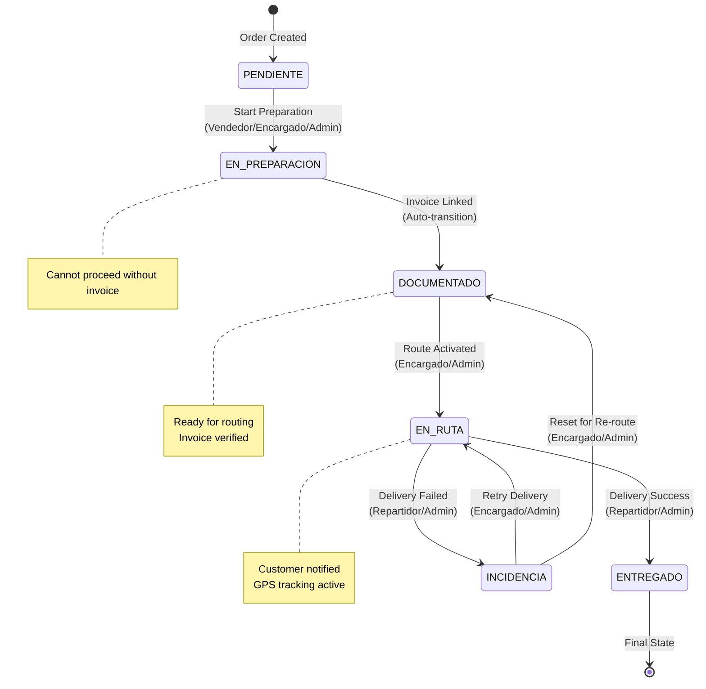

# BUSINESS RULES FORMAL SPECIFICATION - FASE 2
## Sistema de Gestión de Despachos Logísticos - Botillería Rancagua, Chile

**Version:** 2.0.0
**Date:** 2026-01-21
**Author:** business-policy-architect (Claude AI Agent)
**Status:** APPROVED FOR IMPLEMENTATION
**Target Audience:** business-logic-developer, qa-security-tester

---

## Table of Contents

1. [Business Rules Specification (YAML)](#1-business-rules-specification-yaml)
2. [State Transition Matrix](#2-state-transition-matrix)
3. [Permission Matrix (RBAC)](#3-permission-matrix-rbac)
4. [Validation Rules](#4-validation-rules)
5. [Error Messages & HTTP Codes](#5-error-messages--http-codes)
6. [Audit Log Format](#6-audit-log-format)
7. [Implementation Guidelines](#7-implementation-guidelines)
8. [Testing Requirements](#8-testing-requirements)

---

## 1. Business Rules Specification (YAML)

```yaml
business_rules:

  # ============================================================================
  # CATEGORY: CUT-OFF TIME RULES (Delivery Date Calculation)
  # ============================================================================

  BR-001:
    name: "Cut-off AM - Same Day Delivery Eligibility"
    category: "cut_off_time"
    priority: "CRITICAL"
    trigger: "Order creation timestamp <= 12:00:00 America/Santiago"
    timezone: "America/Santiago"

    logic: |
      WHEN order.created_at.time() <= time(12, 0, 0) IN TIMEZONE 'America/Santiago':
        IF is_business_day(order.created_at.date()):
          order.delivery_date = order.created_at.date()  # Same day
        ELSE IF is_saturday(order.created_at.date()):
          order.delivery_date = next_monday(order.created_at.date())
        ELSE IF is_sunday(order.created_at.date()):
          order.delivery_date = next_business_day(order.created_at.date())
        ELSE IF is_holiday(order.created_at.date()):
          order.delivery_date = next_business_day(order.created_at.date())

      # Note: 12:00:00.000000 is INCLUDED (<=)
      # Note: 12:00:00.000001 is EXCLUDED

    edge_cases:
      - condition: "Order created at 11:59:59 AM"
        expected: "delivery_date = today (if business day)"

      - condition: "Order created at 12:00:00 AM (exactly)"
        expected: "delivery_date = today (if business day)"

      - condition: "Order created at 12:00:00.000001 AM"
        expected: "Processed by BR-003 (intermediate window)"

      - condition: "Order created Friday 11:00 AM"
        expected: "delivery_date = Friday (same day)"

      - condition: "Order created Saturday 11:00 AM"
        expected: "delivery_date = Monday (next business day)"

      - condition: "Order created Sunday 11:00 AM"
        expected: "delivery_date = Monday (next business day)"

      - condition: "Order created on Chilean holiday (e.g., 2026-09-18)"
        expected: "delivery_date = next business day"

    business_days:
      weekdays: [Monday, Tuesday, Wednesday, Thursday, Friday]
      excluded_dates:
        - "2026-01-01"  # Año Nuevo
        - "2026-04-03"  # Viernes Santo (variable)
        - "2026-04-04"  # Sábado Santo (variable)
        - "2026-05-01"  # Día del Trabajo
        - "2026-05-21"  # Día de las Glorias Navales
        - "2026-06-29"  # San Pedro y San Pablo
        - "2026-07-16"  # Día de la Virgen del Carmen
        - "2026-08-15"  # Asunción de la Virgen
        - "2026-09-18"  # Día de la Independencia
        - "2026-09-19"  # Día de las Glorias del Ejército
        - "2026-10-12"  # Encuentro de Dos Mundos
        - "2026-10-31"  # Día de las Iglesias Evangélicas
        - "2026-11-01"  # Día de Todos los Santos
        - "2026-12-08"  # Inmaculada Concepción
        - "2026-12-25"  # Navidad
        # Note: Update annually or use holiday API

    validation:
      - "Verify order.created_at is in America/Santiago timezone"
      - "Check created_at.time() <= time(12, 0, 0)"
      - "Validate delivery_date is not in the past"
      - "Validate delivery_date is a business day"

    override_permission: "Administrador"
    audit: true
    audit_action: "APPLY_CUTOFF_AM"

  BR-002:
    name: "Cut-off PM - Next Day Delivery Mandatory"
    category: "cut_off_time"
    priority: "CRITICAL"
    trigger: "Order creation timestamp > 15:00:00 America/Santiago"
    timezone: "America/Santiago"

    logic: |
      WHEN order.created_at.time() > time(15, 0, 0) IN TIMEZONE 'America/Santiago':
        order.delivery_date = next_business_day(order.created_at.date())

      # Note: 15:00:00.000000 is EXCLUDED (>)
      # Note: 15:00:00.000001 is INCLUDED

    edge_cases:
      - condition: "Order created at 15:00:01 PM"
        expected: "delivery_date = next business day"

      - condition: "Order created Friday 15:01 PM"
        expected: "delivery_date = Monday (next business day)"

      - condition: "Order created Friday 23:59:59 PM"
        expected: "delivery_date = Monday (next business day)"

      - condition: "Vendedor attempts to force same-day delivery at 16:00"
        expected: "DENIED - Only Administrador can override"

    exceptions:
      - role: "Administrador"
        can_override: true
        requires_reason: true
        audit_mandatory: true

    override_validation:
      - "Check user role = 'Administrador'"
      - "Require override_reason in request payload"
      - "Log override attempt with full context"

    validation:
      - "Verify order.created_at is in America/Santiago timezone"
      - "Check created_at.time() > time(15, 0, 0)"
      - "If override requested, validate role and reason"

    override_permission: "Administrador"
    audit: true
    audit_action: "APPLY_CUTOFF_PM"

  BR-003:
    name: "Cut-off Intermediate Window (12:00 - 15:00)"
    category: "cut_off_time"
    priority: "HIGH"
    trigger: "Order creation timestamp between 12:00:00 and 15:00:00"
    timezone: "America/Santiago"

    logic: |
      WHEN time(12, 0, 0) < order.created_at.time() <= time(15, 0, 0):
        # Default behavior: Same day delivery (if business day)
        IF is_business_day(order.created_at.date()):
          order.delivery_date = order.created_at.date()  # Same day
        ELSE:
          order.delivery_date = next_business_day(order.created_at.date())

      # Note: This is a FLEXIBLE window where warehouse capacity matters
      # Encargado de Bodega can override to next day if warehouse is full

    edge_cases:
      - condition: "Order created at 12:00:00.000001 PM"
        expected: "delivery_date = today (if business day)"

      - condition: "Order created at 14:59:59 PM"
        expected: "delivery_date = today (if business day)"

      - condition: "Order created at 15:00:00 PM (exactly)"
        expected: "delivery_date = today (if business day)"

      - condition: "Order created at 15:00:00.000001 PM"
        expected: "Processed by BR-002 (next day mandatory)"

    override_permissions:
      - role: "Encargado de Bodega"
        can_override_to: "next_day"
        requires_reason: true

      - role: "Administrador"
        can_override_to: "any_day"
        requires_reason: true

    validation:
      - "Verify time(12, 0, 0) < created_at.time() <= time(15, 0, 0)"
      - "If override requested, validate role and reason"

    audit: true
    audit_action: "APPLY_CUTOFF_INTERMEDIATE"

  # ============================================================================
  # CATEGORY: INVOICE REQUIREMENTS (Critical Business Logic)
  # ============================================================================

  BR-004:
    name: "Invoice Required for Route Assignment"
    category: "invoice_requirement"
    priority: "CRITICAL"
    trigger: "Attempt to assign order to route OR transition to EN_RUTA"

    logic: |
      BEFORE order.assigned_route_id = <route_id>:
        IF order.invoice_id IS NULL:
          RAISE ValidationError("INVOICE_REQUIRED_FOR_ROUTING")

      BEFORE order.order_status = OrderStatus.EN_RUTA:
        IF order.invoice_id IS NULL:
          RAISE ValidationError("INVOICE_REQUIRED_FOR_ROUTING")

        # Additional check: order must be in DOCUMENTADO state
        IF order.order_status != OrderStatus.DOCUMENTADO:
          RAISE ValidationError("INVALID_STATE_FOR_ROUTING")

    validation_points:
      - "Pre-transition validation (before status change)"
      - "Route assignment validation (before setting assigned_route_id)"
      - "Route generation validation (when building route.orders list)"

    database_constraint:
      type: "application_level"
      reason: "Complex logic requires application validation, not DB constraint"
      note: "Consider adding CHECK constraint for additional safety"

    error_handling:
      code: "INVOICE_REQUIRED_FOR_ROUTING"
      http_status: 400
      message_es: "El pedido debe tener una factura asociada antes de ser incluido en una ruta"
      message_en: "Order must have an associated invoice before being included in a route"
      log_level: "WARNING"

    validation:
      - "Check order.invoice_id IS NOT NULL"
      - "Check order.order_status = DOCUMENTADO"
      - "Validate invoice.order_id = order.id (relationship integrity)"

    audit: true
    audit_action: "VALIDATE_INVOICE_FOR_ROUTING"

  BR-005:
    name: "Auto-transition to DOCUMENTADO on Invoice Creation"
    category: "invoice_requirement"
    priority: "CRITICAL"
    trigger: "Invoice record created and linked to order"

    logic: |
      WHEN invoice.order_id = order.id AND invoice.id IS NOT NULL:
        IF order.order_status = OrderStatus.EN_PREPARACION:
          order.order_status = OrderStatus.DOCUMENTADO
          CREATE AuditLog(
            action='AUTO_TRANSITION_DOCUMENTADO',
            entity_type='ORDER',
            entity_id=order.id,
            details={
              'previous_status': 'EN_PREPARACION',
              'new_status': 'DOCUMENTADO',
              'trigger': 'invoice_created',
              'invoice_id': str(invoice.id),
              'invoice_number': invoice.invoice_number
            },
            result=AuditResult.SUCCESS
          )

    prerequisites:
      - "Order must be in EN_PREPARACION state"
      - "Invoice must be successfully committed to database"
      - "Invoice.order_id must reference valid order"

    idempotency:
      behavior: "Skip if already DOCUMENTADO"
      logic: |
        IF order.order_status = OrderStatus.DOCUMENTADO:
          # No-op: Order already in target state
          SKIP

    edge_cases:
      - condition: "Invoice created for PENDIENTE order"
        expected: "No auto-transition (prerequisite not met)"
        action: "Log warning, manual intervention required"

      - condition: "Invoice created for DOCUMENTADO order"
        expected: "No-op (idempotent)"

      - condition: "Invoice created for EN_RUTA order"
        expected: "No-op (order already past DOCUMENTADO)"

      - condition: "Multiple invoices for same order (data integrity violation)"
        expected: "RAISE IntegrityError (DB unique constraint)"

    validation:
      - "Verify invoice.order_id exists and is valid"
      - "Check order.order_status before transition"
      - "Validate invoice data completeness"

    audit: true
    audit_action: "AUTO_TRANSITION_DOCUMENTADO"

  # ============================================================================
  # CATEGORY: STATE TRANSITIONS (Order Lifecycle Management)
  # ============================================================================

  BR-006:
    name: "PENDIENTE → EN_PREPARACION Transition"
    category: "state_transition"
    priority: "HIGH"
    trigger: "User initiates transition to EN_PREPARACION"

    allowed_roles:
      - "Administrador"
      - "Encargado de Bodega"
      - "Vendedor"

    prerequisites:
      - "order.order_status = OrderStatus.PENDIENTE"
      - "order.delivery_date IS NOT NULL (calculated by cut-off rules)"

    logic: |
      IF order.order_status = OrderStatus.PENDIENTE:
        IF user.role IN ['Administrador', 'Encargado de Bodega', 'Vendedor']:
          order.order_status = OrderStatus.EN_PREPARACION
          CREATE AuditLog(action='TRANSITION_EN_PREPARACION', result=SUCCESS)
        ELSE:
          RAISE PermissionError("INSUFFICIENT_PERMISSIONS")
      ELSE:
        RAISE ValidationError("INVALID_STATE_TRANSITION")

    validation:
      - "Check current state = PENDIENTE"
      - "Validate user has required role"
      - "Verify delivery_date is set"

    audit: true
    audit_action: "TRANSITION_EN_PREPARACION"

  BR-007:
    name: "EN_PREPARACION → DOCUMENTADO Transition"
    category: "state_transition"
    priority: "CRITICAL"
    trigger: "Invoice created (auto) OR manual transition (rare)"

    allowed_roles:
      - "System" # Auto-transition via BR-005
      - "Administrador" # Manual override only

    prerequisites:
      - "order.order_status = OrderStatus.EN_PREPARACION"
      - "order.invoice_id IS NOT NULL (invoice must exist)"

    logic: |
      # This transition is NORMALLY automatic via BR-005
      # Manual transition only allowed for Administrador (edge case recovery)

      IF order.order_status = OrderStatus.EN_PREPARACION:
        IF order.invoice_id IS NOT NULL:
          IF user.role = 'Administrador' OR user = 'System':
            order.order_status = OrderStatus.DOCUMENTADO
            CREATE AuditLog(action='TRANSITION_DOCUMENTADO', result=SUCCESS)
          ELSE:
            RAISE PermissionError("INSUFFICIENT_PERMISSIONS")
        ELSE:
          RAISE ValidationError("INVOICE_REQUIRED")
      ELSE:
        RAISE ValidationError("INVALID_STATE_TRANSITION")

    validation:
      - "Check current state = EN_PREPARACION"
      - "Verify invoice_id IS NOT NULL"
      - "Validate invoice exists and is valid"

    audit: true
    audit_action: "TRANSITION_DOCUMENTADO"

  BR-008:
    name: "DOCUMENTADO → EN_RUTA Transition"
    category: "state_transition"
    priority: "CRITICAL"
    trigger: "Order assigned to active route"

    allowed_roles:
      - "Administrador"
      - "Encargado de Bodega"

    prerequisites:
      - "order.order_status = OrderStatus.DOCUMENTADO"
      - "order.invoice_id IS NOT NULL (enforced by BR-004)"
      - "order.assigned_route_id IS NOT NULL"
      - "route.status = RouteStatus.ACTIVE"

    logic: |
      IF order.order_status = OrderStatus.DOCUMENTADO:
        IF user.role IN ['Administrador', 'Encargado de Bodega']:
          IF order.invoice_id IS NOT NULL:
            IF order.assigned_route_id IS NOT NULL:
              route = get_route(order.assigned_route_id)
              IF route.status = RouteStatus.ACTIVE:
                order.order_status = OrderStatus.EN_RUTA
                # TRIGGER: Customer notification (BR-030)
                CREATE AuditLog(action='TRANSITION_EN_RUTA', result=SUCCESS)
              ELSE:
                RAISE ValidationError("ROUTE_NOT_ACTIVE")
            ELSE:
              RAISE ValidationError("ROUTE_NOT_ASSIGNED")
          ELSE:
            RAISE ValidationError("INVOICE_REQUIRED")
        ELSE:
          RAISE PermissionError("INSUFFICIENT_PERMISSIONS")
      ELSE:
        RAISE ValidationError("INVALID_STATE_TRANSITION")

    side_effects:
      - "Trigger customer notification (email/WhatsApp)"
      - "Update route metrics"
      - "Log GPS coordinates of warehouse (start point)"

    validation:
      - "Check current state = DOCUMENTADO"
      - "Verify invoice exists"
      - "Verify route assignment and route is ACTIVE"
      - "Validate user has required role"

    audit: true
    audit_action: "TRANSITION_EN_RUTA"

  BR-009:
    name: "EN_RUTA → ENTREGADO Transition"
    category: "state_transition"
    priority: "HIGH"
    trigger: "Driver confirms successful delivery"

    allowed_roles:
      - "Administrador"
      - "Repartidor" # Only for orders in their assigned route

    prerequisites:
      - "order.order_status = OrderStatus.EN_RUTA"
      - "order.assigned_route_id IS NOT NULL"
      - "IF user.role = 'Repartidor': route.assigned_driver_id = user.id"

    logic: |
      IF order.order_status = OrderStatus.EN_RUTA:
        IF user.role = 'Administrador':
          order.order_status = OrderStatus.ENTREGADO
          CREATE AuditLog(action='TRANSITION_ENTREGADO', result=SUCCESS)

        ELSE IF user.role = 'Repartidor':
          route = get_route(order.assigned_route_id)
          IF route.assigned_driver_id = user.id:
            order.order_status = OrderStatus.ENTREGADO
            CREATE AuditLog(action='TRANSITION_ENTREGADO', result=SUCCESS)
          ELSE:
            RAISE PermissionError("NOT_YOUR_ROUTE")

        ELSE:
          RAISE PermissionError("INSUFFICIENT_PERMISSIONS")
      ELSE:
        RAISE ValidationError("INVALID_STATE_TRANSITION")

    optional_data:
      - "delivery_signature: Base64 image"
      - "delivery_photo: Base64 image"
      - "delivery_notes: Text"
      - "delivery_gps_coordinates: POINT(lat, lon)"
      - "delivery_timestamp: DateTime (auto-captured)"

    validation:
      - "Check current state = EN_RUTA"
      - "Validate user has required role"
      - "IF Repartidor: verify route ownership"
      - "Capture delivery timestamp"

    audit: true
    audit_action: "TRANSITION_ENTREGADO"

  BR-010:
    name: "EN_RUTA → INCIDENCIA Transition"
    category: "state_transition"
    priority: "HIGH"
    trigger: "Driver reports delivery failure"

    allowed_roles:
      - "Administrador"
      - "Repartidor" # Only for orders in their assigned route

    prerequisites:
      - "order.order_status = OrderStatus.EN_RUTA"
      - "order.assigned_route_id IS NOT NULL"
      - "incidence_reason IS NOT NULL (mandatory)"
      - "IF user.role = 'Repartidor': route.assigned_driver_id = user.id"

    logic: |
      IF order.order_status = OrderStatus.EN_RUTA:
        IF incidence_reason IS NULL OR incidence_reason.strip() = '':
          RAISE ValidationError("INCIDENCE_REASON_REQUIRED")

        IF user.role = 'Administrador':
          order.order_status = OrderStatus.INCIDENCIA
          order.notes = CONCAT(order.notes, f"\n[INCIDENCIA] {incidence_reason}")
          CREATE AuditLog(
            action='TRANSITION_INCIDENCIA',
            details={'reason': incidence_reason},
            result=SUCCESS
          )

        ELSE IF user.role = 'Repartidor':
          route = get_route(order.assigned_route_id)
          IF route.assigned_driver_id = user.id:
            order.order_status = OrderStatus.INCIDENCIA
            order.notes = CONCAT(order.notes, f"\n[INCIDENCIA] {incidence_reason}")
            CREATE AuditLog(
              action='TRANSITION_INCIDENCIA',
              details={'reason': incidence_reason},
              result=SUCCESS
            )
          ELSE:
            RAISE PermissionError("NOT_YOUR_ROUTE")

        ELSE:
          RAISE PermissionError("INSUFFICIENT_PERMISSIONS")
      ELSE:
        RAISE ValidationError("INVALID_STATE_TRANSITION")

    incidence_reasons:
      - "Cliente ausente"
      - "Dirección incorrecta"
      - "Cliente rechazó pedido"
      - "Problema con pago"
      - "Acceso bloqueado (portería, etc.)"
      - "Otro (especificar)"

    optional_data:
      - "incidence_photo: Base64 image"
      - "incidence_gps_coordinates: POINT(lat, lon)"
      - "incidence_timestamp: DateTime (auto-captured)"

    validation:
      - "Check current state = EN_RUTA"
      - "Validate incidence_reason is provided and non-empty"
      - "Validate user has required role"
      - "IF Repartidor: verify route ownership"

    audit: true
    audit_action: "TRANSITION_INCIDENCIA"

  BR-011:
    name: "INCIDENCIA → EN_RUTA Transition (Retry)"
    category: "state_transition"
    priority: "MEDIUM"
    trigger: "Encargado/Admin decides to retry delivery"

    allowed_roles:
      - "Administrador"
      - "Encargado de Bodega"

    prerequisites:
      - "order.order_status = OrderStatus.INCIDENCIA"
      - "order.assigned_route_id IS NOT NULL OR new route assigned"

    logic: |
      IF order.order_status = OrderStatus.INCIDENCIA:
        IF user.role IN ['Administrador', 'Encargado de Bodega']:
          order.order_status = OrderStatus.EN_RUTA
          CREATE AuditLog(action='RETRY_DELIVERY', result=SUCCESS)
        ELSE:
          RAISE PermissionError("INSUFFICIENT_PERMISSIONS")
      ELSE:
        RAISE ValidationError("INVALID_STATE_TRANSITION")

    validation:
      - "Check current state = INCIDENCIA"
      - "Validate user has required role"
      - "Verify route assignment (existing or new)"

    audit: true
    audit_action: "RETRY_DELIVERY"

  BR-012:
    name: "INCIDENCIA → DOCUMENTADO Transition (Reset to Retry)"
    category: "state_transition"
    priority: "MEDIUM"
    trigger: "Reset order to re-assign to different route"

    allowed_roles:
      - "Administrador"
      - "Encargado de Bodega"

    prerequisites:
      - "order.order_status = OrderStatus.INCIDENCIA"
      - "order.invoice_id IS NOT NULL"

    logic: |
      IF order.order_status = OrderStatus.INCIDENCIA:
        IF user.role IN ['Administrador', 'Encargado de Bodega']:
          order.order_status = OrderStatus.DOCUMENTADO
          order.assigned_route_id = NULL  # Clear route assignment
          CREATE AuditLog(action='RESET_TO_DOCUMENTADO', result=SUCCESS)
        ELSE:
          RAISE PermissionError("INSUFFICIENT_PERMISSIONS")
      ELSE:
        RAISE ValidationError("INVALID_STATE_TRANSITION")

    validation:
      - "Check current state = INCIDENCIA"
      - "Validate user has required role"
      - "Verify invoice still exists"

    audit: true
    audit_action: "RESET_TO_DOCUMENTADO"

  BR-013:
    name: "Invalid Backward Transitions"
    category: "state_transition"
    priority: "CRITICAL"
    trigger: "Any attempt to move backward (except explicitly allowed)"

    forbidden_transitions:
      - from: "ENTREGADO"
        to: "*"
        reason: "Delivered orders are final and cannot be reversed"
        exception: "Administrador can override with audit log (rare edge case)"

      - from: "DOCUMENTADO"
        to: "EN_PREPARACION"
        reason: "Cannot un-document an order"

      - from: "DOCUMENTADO"
        to: "PENDIENTE"
        reason: "Cannot revert to pending after documentation"

      - from: "EN_RUTA"
        to: "DOCUMENTADO"
        reason: "Cannot un-route an order (use INCIDENCIA instead)"

      - from: "EN_RUTA"
        to: "EN_PREPARACION"
        reason: "Cannot revert to preparation while in transit"

      - from: "EN_RUTA"
        to: "PENDIENTE"
        reason: "Cannot revert to pending while in transit"

    logic: |
      # All backward transitions (except explicitly allowed in BR-011, BR-012)
      # should be DENIED with appropriate error message

      allowed_backward_transitions = [
        (OrderStatus.INCIDENCIA, OrderStatus.EN_RUTA),     # BR-011
        (OrderStatus.INCIDENCIA, OrderStatus.DOCUMENTADO)  # BR-012
      ]

      IF (from_status, to_status) NOT IN allowed_backward_transitions:
        IF state_order(from_status) > state_order(to_status):
          RAISE ValidationError("BACKWARD_TRANSITION_FORBIDDEN")

    validation:
      - "Check if transition is backward"
      - "Verify if transition is in allowed_backward_transitions"
      - "Log denial with full context"

    audit: true
    audit_action: "DENY_BACKWARD_TRANSITION"

  # ============================================================================
  # CATEGORY: PERMISSION & AUTHORIZATION (RBAC)
  # ============================================================================

  BR-014:
    name: "Role-Based Access Control - Order Creation"
    category: "authorization"
    priority: "HIGH"

    permissions:
      Administrador:
        can_create_order: true
        can_view_all_orders: true
        can_view_own_orders: true

      Encargado_de_Bodega:
        can_create_order: true
        can_view_all_orders: true
        can_view_own_orders: true

      Vendedor:
        can_create_order: true
        can_view_all_orders: false
        can_view_own_orders: true  # Only orders they created

      Repartidor:
        can_create_order: false
        can_view_all_orders: false
        can_view_own_orders: false
        can_view_assigned_orders: true  # Only orders in their routes

  BR-015:
    name: "Role-Based Access Control - Invoice Operations"
    category: "authorization"
    priority: "HIGH"

    permissions:
      Administrador:
        can_create_invoice: true
        can_view_all_invoices: true
        can_delete_invoice: true  # Rare, requires strong audit

      Encargado_de_Bodega:
        can_create_invoice: true
        can_view_all_invoices: true
        can_delete_invoice: false

      Vendedor:
        can_create_invoice: true
        can_view_all_invoices: false
        can_view_own_invoices: true
        can_delete_invoice: false

      Repartidor:
        can_create_invoice: false
        can_view_all_invoices: false
        can_view_own_invoices: false

  BR-016:
    name: "Role-Based Access Control - Route Operations"
    category: "authorization"
    priority: "CRITICAL"

    permissions:
      Administrador:
        can_generate_route: true
        can_view_all_routes: true
        can_assign_driver: true
        can_activate_route: true
        can_complete_route: true

      Encargado_de_Bodega:
        can_generate_route: true
        can_view_all_routes: true
        can_assign_driver: true
        can_activate_route: true
        can_complete_route: true

      Vendedor:
        can_generate_route: false
        can_view_all_routes: false
        can_assign_driver: false
        can_activate_route: false
        can_complete_route: false

      Repartidor:
        can_generate_route: false
        can_view_all_routes: false
        can_view_assigned_routes: true  # Only their routes
        can_assign_driver: false
        can_activate_route: false
        can_complete_route: false

  BR-017:
    name: "Admin Override - Cut-off Time Rules"
    category: "authorization"
    priority: "CRITICAL"

    logic: |
      # Only Administrador can override cut-off rules
      # Requires explicit override_reason
      # Creates high-priority audit log

      IF user.role = 'Administrador':
        IF override_delivery_date_requested:
          IF override_reason IS NULL OR override_reason.strip() = '':
            RAISE ValidationError("OVERRIDE_REASON_REQUIRED")

          order.delivery_date = requested_delivery_date

          CREATE AuditLog(
            action='OVERRIDE_CUTOFF_TIME',
            details={
              'original_delivery_date': calculated_delivery_date,
              'override_delivery_date': requested_delivery_date,
              'override_reason': override_reason,
              'created_at_time': order.created_at.time()
            },
            result=AuditResult.SUCCESS
          )
      ELSE:
        RAISE PermissionError("ADMIN_OVERRIDE_REQUIRED")

    validation:
      - "Verify user.role = 'Administrador'"
      - "Require override_reason (non-empty string)"
      - "Log with HIGH priority"

    audit: true
    audit_action: "OVERRIDE_CUTOFF_TIME"

  # ============================================================================
  # CATEGORY: AUDIT & COMPLIANCE
  # ============================================================================

  BR-018:
    name: "Mandatory Audit Logging - Critical Actions"
    category: "audit"
    priority: "CRITICAL"

    mandatory_audit_actions:
      # State Transitions
      - "TRANSITION_EN_PREPARACION"
      - "TRANSITION_DOCUMENTADO"
      - "TRANSITION_EN_RUTA"
      - "TRANSITION_ENTREGADO"
      - "TRANSITION_INCIDENCIA"
      - "RETRY_DELIVERY"
      - "RESET_TO_DOCUMENTADO"

      # Overrides
      - "OVERRIDE_CUTOFF_TIME"
      - "FORCE_DELIVERY_DATE"
      - "ADMIN_OVERRIDE"

      # Permission Denials
      - "PERMISSION_DENIED"
      - "INVALID_STATE_TRANSITION"
      - "BACKWARD_TRANSITION_FORBIDDEN"

      # Business Rule Validations
      - "INVOICE_REQUIRED_FOR_ROUTING"
      - "APPLY_CUTOFF_AM"
      - "APPLY_CUTOFF_PM"
      - "APPLY_CUTOFF_INTERMEDIATE"

      # Route Operations
      - "GENERATE_ROUTE"
      - "ACTIVATE_ROUTE"
      - "COMPLETE_ROUTE"
      - "ASSIGN_DRIVER"

      # User Management
      - "CREATE_USER"
      - "UPDATE_USER_ROLE"
      - "DEACTIVATE_USER"

    audit_log_structure:
      required_fields:
        - "timestamp: DateTime (auto-generated)"
        - "user_id: UUID (null for system actions)"
        - "action: String (from mandatory_audit_actions)"
        - "entity_type: String (ORDER, INVOICE, ROUTE, USER)"
        - "entity_id: UUID (affected entity)"
        - "result: AuditResult (SUCCESS, DENIED, ERROR)"

      optional_fields:
        - "details: JSONB (action-specific context)"
        - "ip_address: INET (client IP)"

      recommended_details_content:
        state_transitions:
          - "previous_status"
          - "new_status"
          - "trigger_reason"

        overrides:
          - "override_reason"
          - "original_value"
          - "override_value"

        permission_denials:
          - "user_role"
          - "required_role"
          - "attempted_action"

  BR-019:
    name: "Audit Log Retention & Access"
    category: "audit"
    priority: "MEDIUM"

    retention_policy:
      minimum_retention: "5 years (Chilean tax requirements)"
      archive_after: "1 year (move to cold storage)"
      deletion_policy: "Never delete (regulatory compliance)"

    access_control:
      Administrador:
        can_view_all_audit_logs: true
        can_export_audit_logs: true

      Encargado_de_Bodega:
        can_view_operational_audit_logs: true  # Orders, routes
        can_view_user_audit_logs: false
        can_export_audit_logs: false

      Vendedor:
        can_view_own_audit_logs: true  # Only their actions
        can_export_audit_logs: false

      Repartidor:
        can_view_own_audit_logs: true  # Only their actions
        can_export_audit_logs: false

  # ============================================================================
  # CATEGORY: DATA VALIDATION & QUALITY
  # ============================================================================

  BR-020:
    name: "Geocoding Quality Validation"
    category: "data_quality"
    priority: "HIGH"

    logic: |
      # Before including order in route optimization
      IF order.geocoding_confidence IN [GeocodingConfidence.LOW, GeocodingConfidence.INVALID]:
        RAISE ValidationError("INSUFFICIENT_GEOCODING_QUALITY")

      # Acceptable for routing: HIGH, MEDIUM
      # Require manual intervention: LOW, INVALID

    validation:
      - "Check geocoding_confidence before route assignment"
      - "Alert Encargado de Bodega for LOW/INVALID addresses"
      - "Provide address correction interface"

    audit: true
    audit_action: "VALIDATE_GEOCODING_QUALITY"

  BR-021:
    name: "Business Day Calculation"
    category: "data_quality"
    priority: "HIGH"

    logic: |
      # Used by BR-001, BR-002, BR-003

      FUNCTION is_business_day(date: Date) -> bool:
        IF date.weekday() IN [5, 6]:  # Saturday=5, Sunday=6
          RETURN False

        IF date IN CHILEAN_HOLIDAYS:
          RETURN False

        RETURN True

      FUNCTION next_business_day(date: Date) -> Date:
        next_date = date + timedelta(days=1)
        WHILE NOT is_business_day(next_date):
          next_date = next_date + timedelta(days=1)
        RETURN next_date

    chilean_holidays_source:
      - "Maintain static list (update annually)"
      - "OR integrate with holiday API (e.g., Calendarific)"

    validation:
      - "Verify date is not in past"
      - "Verify date is business day"

  # ============================================================================
  # CATEGORY: CONCURRENCY & IDEMPOTENCY
  # ============================================================================

  BR-022:
    name: "Optimistic Locking for State Transitions"
    category: "concurrency"
    priority: "CRITICAL"

    logic: |
      # Prevent race conditions when multiple users transition same order

      # Option 1: Database-level optimistic locking (recommended)
      UPDATE orders
      SET order_status = new_status, updated_at = now()
      WHERE id = order_id
        AND order_status = expected_current_status  # Optimistic lock
        AND updated_at = expected_updated_at        # Version check

      IF affected_rows = 0:
        RAISE ConcurrencyError("ORDER_MODIFIED_BY_ANOTHER_USER")

      # Option 2: SELECT FOR UPDATE (pessimistic locking)
      # Use for critical sections only (performance impact)

    validation:
      - "Check updated_at timestamp before update"
      - "Return 409 Conflict on concurrent modification"
      - "Instruct client to retry with fresh data"

    error_handling:
      code: "CONCURRENT_MODIFICATION"
      http_status: 409
      message_es: "El pedido fue modificado por otro usuario. Por favor, actualiza y reintenta."
      message_en: "Order was modified by another user. Please refresh and retry."

  BR-023:
    name: "Idempotent State Transitions"
    category: "concurrency"
    priority: "HIGH"

    logic: |
      # Repeated requests for same transition should be idempotent

      IF order.order_status = target_status:
        # Already in target state - no-op
        RETURN {
          'status': 'success',
          'message': 'Order already in target state',
          'current_status': target_status
        }

      # Otherwise, proceed with transition validation

    validation:
      - "Check if already in target state before validation"
      - "Return success (not error) for idempotent requests"

  # ============================================================================
  # CATEGORY: ROUTE OPTIMIZATION
  # ============================================================================

  BR-024:
    name: "Route Generation - Eligible Orders"
    category: "route_optimization"
    priority: "CRITICAL"

    logic: |
      # Only orders in DOCUMENTADO state can be included in routes

      eligible_orders = SELECT * FROM orders
      WHERE order_status = OrderStatus.DOCUMENTADO
        AND delivery_date = target_delivery_date
        AND assigned_route_id IS NULL
        AND invoice_id IS NOT NULL  # Redundant but explicit
        AND geocoding_confidence IN [GeocodingConfidence.HIGH, GeocodingConfidence.MEDIUM]

      # Pass eligible_orders to route optimizer (OR-Tools)

    validation:
      - "Verify all orders are in DOCUMENTADO state"
      - "Verify all orders have invoice_id"
      - "Verify geocoding quality is sufficient"
      - "Verify delivery_date matches target date"

    audit: true
    audit_action: "GENERATE_ROUTE"

  BR-025:
    name: "Route Activation - Prerequisites"
    category: "route_optimization"
    priority: "HIGH"

    logic: |
      # Before activating route (DRAFT → ACTIVE)

      IF route.status = RouteStatus.DRAFT:
        IF route.assigned_driver_id IS NULL:
          RAISE ValidationError("DRIVER_NOT_ASSIGNED")

        IF route.stop_sequence IS NULL OR len(route.stop_sequence) = 0:
          RAISE ValidationError("ROUTE_HAS_NO_STOPS")

        # Verify all orders in stop_sequence are valid
        FOR order_id IN route.stop_sequence:
          order = get_order(order_id)
          IF order.order_status != OrderStatus.DOCUMENTADO:
            RAISE ValidationError("ORDER_NOT_READY_FOR_ROUTING")

        route.status = RouteStatus.ACTIVE
        route.started_at = now()

        # Transition all orders to EN_RUTA
        FOR order_id IN route.stop_sequence:
          order = get_order(order_id)
          order.order_status = OrderStatus.EN_RUTA
          order.assigned_route_id = route.id

    validation:
      - "Verify driver is assigned"
      - "Verify stop_sequence is non-empty"
      - "Verify all orders are in DOCUMENTADO state"

    audit: true
    audit_action: "ACTIVATE_ROUTE"

  # ============================================================================
  # CATEGORY: NOTIFICATIONS
  # ============================================================================

  BR-026:
    name: "Customer Notification - Order EN_RUTA"
    category: "notifications"
    priority: "MEDIUM"
    trigger: "Order transitions to EN_RUTA"

    logic: |
      # Trigger asynchronous notification when order transitions to EN_RUTA

      WHEN order.order_status = OrderStatus.EN_RUTA:
        IF order.customer_phone IS NOT NULL:
          SEND WhatsAppNotification(
            to=order.customer_phone,
            template='order_en_route',
            params={
              'customer_name': order.customer_name,
              'order_number': order.order_number,
              'estimated_time': calculate_eta(order)
            }
          )

        IF order.customer_email IS NOT NULL:
          SEND EmailNotification(
            to=order.customer_email,
            subject=f"Tu pedido {order.order_number} está en camino",
            template='order_en_route_email',
            params={
              'customer_name': order.customer_name,
              'order_number': order.order_number,
              'estimated_time': calculate_eta(order)
            }
          )

    validation:
      - "Verify customer contact info exists"
      - "Handle notification failures gracefully (retry queue)"
      - "Log notification status"

    audit: true
    audit_action: "SEND_CUSTOMER_NOTIFICATION"
```

---

## 2. State Transition Matrix

### 2.1. Valid Transitions

| From State | To State | Allowed | Who Can Execute | Prerequisites | Business Rule | Audit |
|------------|----------|---------|-----------------|---------------|---------------|-------|
| **PENDIENTE** | EN_PREPARACION | ✅ Yes | Administrador, Encargado, Vendedor | delivery_date set | BR-006 | Yes |
| **PENDIENTE** | DOCUMENTADO | ❌ No | - | - | Must go through EN_PREPARACION | - |
| **PENDIENTE** | EN_RUTA | ❌ No | - | - | Invalid skip | - |
| **PENDIENTE** | ENTREGADO | ❌ No | - | - | Invalid skip | - |
| **PENDIENTE** | INCIDENCIA | ❌ No | - | - | Invalid skip | - |
| **EN_PREPARACION** | PENDIENTE | ❌ No | - | - | Backward transition forbidden | BR-013 |
| **EN_PREPARACION** | DOCUMENTADO | ✅ Yes (auto) | System, Administrador | invoice_id set | BR-005, BR-007 | Yes |
| **EN_PREPARACION** | EN_RUTA | ❌ No | - | - | Must be DOCUMENTADO first | - |
| **EN_PREPARACION** | ENTREGADO | ❌ No | - | - | Invalid skip | - |
| **EN_PREPARACION** | INCIDENCIA | ❌ No | - | - | Invalid skip | - |
| **DOCUMENTADO** | PENDIENTE | ❌ No | - | - | Backward transition forbidden | BR-013 |
| **DOCUMENTADO** | EN_PREPARACION | ❌ No | - | - | Backward transition forbidden | BR-013 |
| **DOCUMENTADO** | EN_RUTA | ✅ Yes | Administrador, Encargado | Route assigned & active | BR-008 | Yes |
| **DOCUMENTADO** | ENTREGADO | ❌ No | - | - | Must be EN_RUTA first | - |
| **DOCUMENTADO** | INCIDENCIA | ❌ No | - | - | Must be EN_RUTA first | - |
| **EN_RUTA** | PENDIENTE | ❌ No | - | - | Backward transition forbidden | BR-013 |
| **EN_RUTA** | EN_PREPARACION | ❌ No | - | - | Backward transition forbidden | BR-013 |
| **EN_RUTA** | DOCUMENTADO | ❌ No | - | - | Backward transition forbidden | BR-013 |
| **EN_RUTA** | ENTREGADO | ✅ Yes | Administrador, Repartidor (own route) | None | BR-009 | Yes |
| **EN_RUTA** | INCIDENCIA | ✅ Yes | Administrador, Repartidor (own route) | Reason required | BR-010 | Yes |
| **ENTREGADO** | * (any) | ❌ No | - | - | Final state (except Admin override) | BR-013 |
| **INCIDENCIA** | PENDIENTE | ❌ No | - | - | Invalid transition | - |
| **INCIDENCIA** | EN_PREPARACION | ❌ No | - | - | Invalid transition | - |
| **INCIDENCIA** | DOCUMENTADO | ✅ Yes | Administrador, Encargado | Reset for re-routing | BR-012 | Yes |
| **INCIDENCIA** | EN_RUTA | ✅ Yes | Administrador, Encargado | Retry delivery | BR-011 | Yes |
| **INCIDENCIA** | ENTREGADO | ❌ No | - | - | Must retry via EN_RUTA | - |

### 2.2. State Machine Diagram (Mermaid)



---

## 3. Permission Matrix (RBAC)

### 3.1. Order Operations

| Action | Administrador | Encargado Bodega | Vendedor | Repartidor |
|--------|---------------|------------------|----------|------------|
| **create_order** | ✅ All | ✅ All | ✅ All | ❌ None |
| **view_order** | ✅ All orders | ✅ All orders | ✅ Own orders only | ✅ Assigned routes only |
| **edit_order_details** | ✅ All | ✅ All | ✅ Own orders (before EN_RUTA) | ❌ None |
| **delete_order** | ✅ All (with audit) | ❌ None | ❌ None | ❌ None |
| **force_delivery_date** | ✅ Yes (with reason) | ❌ No | ❌ No | ❌ No |
| **override_cutoff** | ✅ Yes (with reason) | ❌ No | ❌ No | ❌ No |

### 3.2. State Transition Permissions

| Transition | Administrador | Encargado Bodega | Vendedor | Repartidor |
|------------|---------------|------------------|----------|------------|
| **PENDIENTE → EN_PREPARACION** | ✅ Yes | ✅ Yes | ✅ Yes | ❌ No |
| **EN_PREPARACION → DOCUMENTADO** | ✅ Yes (manual) | ❌ No (auto only) | ❌ No (auto only) | ❌ No |
| **DOCUMENTADO → EN_RUTA** | ✅ Yes | ✅ Yes | ❌ No | ❌ No |
| **EN_RUTA → ENTREGADO** | ✅ Yes (any order) | ❌ No | ❌ No | ✅ Yes (own route only) |
| **EN_RUTA → INCIDENCIA** | ✅ Yes (any order) | ❌ No | ❌ No | ✅ Yes (own route only) |
| **INCIDENCIA → EN_RUTA** | ✅ Yes | ✅ Yes | ❌ No | ❌ No |
| **INCIDENCIA → DOCUMENTADO** | ✅ Yes | ✅ Yes | ❌ No | ❌ No |

### 3.3. Invoice Operations

| Action | Administrador | Encargado Bodega | Vendedor | Repartidor |
|--------|---------------|------------------|----------|------------|
| **create_invoice** | ✅ All | ✅ All | ✅ All | ❌ None |
| **view_invoice** | ✅ All | ✅ All | ✅ Own only | ❌ None |
| **edit_invoice** | ✅ All (with audit) | ❌ None | ❌ None | ❌ None |
| **delete_invoice** | ✅ Yes (with strong audit) | ❌ No | ❌ No | ❌ No |
| **link_invoice_to_order** | ✅ Yes | ✅ Yes | ✅ Yes (own orders) | ❌ No |

### 3.4. Route Operations

| Action | Administrador | Encargado Bodega | Vendedor | Repartidor |
|--------|---------------|------------------|----------|------------|
| **generate_route** | ✅ Yes | ✅ Yes | ❌ No | ❌ No |
| **view_route** | ✅ All routes | ✅ All routes | ❌ None | ✅ Assigned routes only |
| **assign_driver** | ✅ Yes | ✅ Yes | ❌ No | ❌ No |
| **activate_route** | ✅ Yes | ✅ Yes | ❌ No | ❌ No |
| **complete_route** | ✅ Yes | ✅ Yes | ❌ No | ❌ No |
| **edit_route_sequence** | ✅ Yes (draft only) | ✅ Yes (draft only) | ❌ No | ❌ No |

### 3.5. User & System Administration

| Action | Administrador | Encargado Bodega | Vendedor | Repartidor |
|--------|---------------|------------------|----------|------------|
| **create_user** | ✅ Yes | ❌ No | ❌ No | ❌ No |
| **edit_user** | ✅ Yes | ❌ No | ❌ No | ❌ No |
| **deactivate_user** | ✅ Yes | ❌ No | ❌ No | ❌ No |
| **change_user_role** | ✅ Yes | ❌ No | ❌ No | ❌ No |
| **view_audit_logs** | ✅ All | ✅ Operational only | ✅ Own only | ✅ Own only |
| **export_audit_logs** | ✅ Yes | ❌ No | ❌ No | ❌ No |
| **system_configuration** | ✅ Yes | ❌ No | ❌ No | ❌ No |

### 3.6. Permission Validation Logic

```python
def check_permission(user: User, action: str, resource: Any = None) -> bool:
    """
    Centralized permission validation

    Args:
        user: Authenticated user
        action: Action being attempted (e.g., 'create_order', 'transition_to_EN_RUTA')
        resource: Optional resource being accessed (e.g., Order, Route)

    Returns:
        bool: True if user has permission, False otherwise

    Raises:
        PermissionError: If permission is denied
    """

    # Admin has all permissions (except those requiring explicit reason)
    if user.role.role_name == 'Administrador':
        return True

    # Role-specific permissions from role.permissions JSONB
    role_permissions = user.role.permissions.get('actions', {})

    if action not in role_permissions:
        raise PermissionError(f"Action '{action}' not defined for role '{user.role.role_name}'")

    # Check if action is allowed
    if not role_permissions[action].get('allowed', False):
        raise PermissionError(f"User lacks permission for action: {action}")

    # Resource-level checks (e.g., "own orders only")
    if resource and role_permissions[action].get('scope') == 'own':
        if isinstance(resource, Order):
            if resource.created_by_user_id != user.id:
                raise PermissionError("User can only access their own orders")

        elif isinstance(resource, Route):
            if resource.assigned_driver_id != user.id:
                raise PermissionError("User can only access their assigned routes")

    return True
```

---

## 4. Validation Rules

### 4.1. Order Validation

| Field | Validation Rule | Error Code | Priority |
|-------|----------------|------------|----------|
| **order_number** | Unique, format: ORD-YYYYMMDD-NNNN | INVALID_ORDER_NUMBER | HIGH |
| **customer_name** | Non-empty, max 255 chars | CUSTOMER_NAME_REQUIRED | HIGH |
| **customer_phone** | Valid Chilean phone (+569...) | INVALID_PHONE_FORMAT | HIGH |
| **customer_email** | Valid email format (optional) | INVALID_EMAIL_FORMAT | MEDIUM |
| **address_text** | Non-empty, min 10 chars | ADDRESS_REQUIRED | CRITICAL |
| **address_coordinates** | Valid POINT geometry (if set) | INVALID_COORDINATES | HIGH |
| **geocoding_confidence** | Enum value (if coordinates set) | INVALID_GEOCODING_CONFIDENCE | MEDIUM |
| **delivery_date** | Business day, not in past | INVALID_DELIVERY_DATE | CRITICAL |
| **source_channel** | Valid enum (WEB, RRSS, PRESENCIAL) | INVALID_SOURCE_CHANNEL | MEDIUM |

### 4.2. Invoice Validation

| Field | Validation Rule | Error Code | Priority |
|-------|----------------|------------|----------|
| **invoice_number** | Unique, non-empty | DUPLICATE_INVOICE_NUMBER | CRITICAL |
| **order_id** | Valid Order UUID, unique (1-to-1) | INVALID_ORDER_ID | CRITICAL |
| **invoice_type** | Valid enum (FACTURA, BOLETA) | INVALID_INVOICE_TYPE | HIGH |
| **total_amount** | Positive decimal, max 2 decimals | INVALID_AMOUNT | CRITICAL |
| **issued_at** | Valid datetime, not in future | INVALID_ISSUE_DATE | MEDIUM |

### 4.3. Route Validation

| Field | Validation Rule | Error Code | Priority |
|-------|----------------|------------|----------|
| **route_name** | Non-empty, unique per date | DUPLICATE_ROUTE_NAME | MEDIUM |
| **route_date** | Business day, not in past | INVALID_ROUTE_DATE | HIGH |
| **assigned_driver_id** | Valid User UUID with Repartidor role | INVALID_DRIVER | HIGH |
| **stop_sequence** | Valid JSON array of Order UUIDs | INVALID_STOP_SEQUENCE | CRITICAL |
| **total_distance_km** | Positive decimal (if set) | INVALID_DISTANCE | LOW |

### 4.4. Validation Implementation Example

```python
from pydantic import BaseModel, validator, UUID4
from datetime import date, time
import re

class OrderCreateSchema(BaseModel):
    customer_name: str
    customer_phone: str
    customer_email: str | None = None
    address_text: str
    source_channel: SourceChannel

    @validator('customer_name')
    def validate_customer_name(cls, v):
        if not v or len(v.strip()) == 0:
            raise ValueError("Customer name is required")
        if len(v) > 255:
            raise ValueError("Customer name exceeds maximum length")
        return v.strip()

    @validator('customer_phone')
    def validate_phone(cls, v):
        # Chilean phone: +569 XXXX XXXX
        pattern = r'^\+569\d{8}$'
        if not re.match(pattern, v):
            raise ValueError("Invalid Chilean phone format. Expected: +569XXXXXXXX")
        return v

    @validator('customer_email')
    def validate_email(cls, v):
        if v is None:
            return v
        email_pattern = r'^[a-zA-Z0-9._%+-]+@[a-zA-Z0-9.-]+\.[a-zA-Z]{2,}$'
        if not re.match(email_pattern, v):
            raise ValueError("Invalid email format")
        return v

    @validator('address_text')
    def validate_address(cls, v):
        if not v or len(v.strip()) < 10:
            raise ValueError("Address must be at least 10 characters")
        return v.strip()
```

---

## 5. Error Messages & HTTP Codes

### 5.1. Business Rule Violations

| Error Code | HTTP Status | Message (ES) | Message (EN) | Details |
|------------|-------------|--------------|--------------|---------|
| **INVOICE_REQUIRED_FOR_ROUTING** | 400 | El pedido debe tener una factura asociada antes de ser incluido en una ruta | Order must have an associated invoice before being included in a route | Include order_id, invoice_id |
| **INVALID_STATE_TRANSITION** | 400 | Transición de estado inválida de {from_state} a {to_state} | Invalid state transition from {from_state} to {to_state} | Include allowed transitions |
| **BACKWARD_TRANSITION_FORBIDDEN** | 403 | No se permite retroceder del estado {from_state} a {to_state} | Backward transition from {from_state} to {to_state} is not allowed | - |
| **CUTOFF_TIME_VIOLATION** | 400 | Pedidos después de las 15:00 no pueden tener entrega mismo día | Orders after 15:00 cannot have same-day delivery | Include created_at, cutoff_time |
| **INSUFFICIENT_GEOCODING_QUALITY** | 400 | La dirección tiene baja calidad de geocodificación. Requiere revisión manual | Address has low geocoding quality. Requires manual review | Include geocoding_confidence |
| **INCIDENCE_REASON_REQUIRED** | 400 | Debe proporcionar un motivo para marcar el pedido como incidencia | Must provide a reason for marking order as incident | - |
| **OVERRIDE_REASON_REQUIRED** | 400 | Debe proporcionar una justificación para sobrescribir esta regla de negocio | Must provide justification for overriding this business rule | - |
| **ROUTE_NOT_ACTIVE** | 400 | La ruta debe estar activa para transicionar pedidos a EN_RUTA | Route must be active to transition orders to EN_RUTA | Include route_id, route_status |
| **DRIVER_NOT_ASSIGNED** | 400 | Debe asignar un repartidor antes de activar la ruta | Must assign a driver before activating route | Include route_id |
| **INVALID_DELIVERY_DATE** | 400 | La fecha de entrega debe ser un día hábil y no puede estar en el pasado | Delivery date must be a business day and cannot be in the past | Include delivery_date |

### 5.2. Permission Errors

| Error Code | HTTP Status | Message (ES) | Message (EN) | Details |
|------------|-------------|--------------|--------------|---------|
| **INSUFFICIENT_PERMISSIONS** | 403 | No tiene permisos suficientes para realizar esta acción | Insufficient permissions to perform this action | Include required_role, user_role |
| **ADMIN_OVERRIDE_REQUIRED** | 403 | Esta acción requiere autorización de un Administrador | This action requires Administrator authorization | - |
| **NOT_YOUR_ROUTE** | 403 | Solo puede modificar pedidos de rutas asignadas a usted | Can only modify orders in routes assigned to you | Include route_id, assigned_driver_id |
| **NOT_YOUR_ORDER** | 403 | Solo puede acceder a pedidos creados por usted | Can only access orders created by you | Include order_id, created_by_user_id |

### 5.3. Data Validation Errors

| Error Code | HTTP Status | Message (ES) | Message (EN) | Details |
|------------|-------------|--------------|--------------|---------|
| **CUSTOMER_NAME_REQUIRED** | 400 | El nombre del cliente es obligatorio | Customer name is required | - |
| **INVALID_PHONE_FORMAT** | 400 | Formato de teléfono inválido. Use: +569XXXXXXXX | Invalid phone format. Use: +569XXXXXXXX | - |
| **ADDRESS_REQUIRED** | 400 | La dirección es obligatoria y debe tener al menos 10 caracteres | Address is required and must be at least 10 characters | - |
| **INVALID_ORDER_NUMBER** | 400 | Número de pedido inválido o duplicado | Invalid or duplicate order number | - |
| **DUPLICATE_INVOICE_NUMBER** | 400 | El número de factura ya existe | Invoice number already exists | Include invoice_number |
| **INVALID_AMOUNT** | 400 | El monto debe ser un número positivo | Amount must be a positive number | - |

### 5.4. Concurrency Errors

| Error Code | HTTP Status | Message (ES) | Message (EN) | Details |
|------------|-------------|--------------|--------------|---------|
| **CONCURRENT_MODIFICATION** | 409 | El pedido fue modificado por otro usuario. Actualiza y reintenta | Order was modified by another user. Refresh and retry | Include updated_at timestamps |
| **ROUTE_ALREADY_ACTIVE** | 409 | La ruta ya está activa | Route is already active | Include route_id |

### 5.5. Error Response Format

```json
{
  "error": {
    "code": "INVOICE_REQUIRED_FOR_ROUTING",
    "message": "El pedido debe tener una factura asociada antes de ser incluido en una ruta",
    "message_en": "Order must have an associated invoice before being included in a route",
    "details": {
      "order_id": "550e8400-e29b-41d4-a716-446655440000",
      "invoice_id": null,
      "order_status": "EN_PREPARACION"
    },
    "timestamp": "2026-01-21T14:35:22.123456-03:00",
    "request_id": "req_abc123xyz"
  }
}
```

---

## 6. Audit Log Format

### 6.1. Standard Audit Log Entry

```json
{
  "id": "uuid-v4",
  "timestamp": "2026-01-21T14:35:22.123456-03:00",
  "user_id": "550e8400-e29b-41d4-a716-446655440000",
  "user_role": "Vendedor",
  "user_username": "vendedor_01",
  "action": "TRANSITION_EN_PREPARACION",
  "entity_type": "ORDER",
  "entity_id": "660e8400-e29b-41d4-a716-446655440001",
  "result": "SUCCESS",
  "ip_address": "192.168.1.100",
  "details": {
    "previous_status": "PENDIENTE",
    "new_status": "EN_PREPARACION",
    "order_number": "ORD-20260121-0042"
  }
}
```

### 6.2. Override Audit Log Entry

```json
{
  "id": "uuid-v4",
  "timestamp": "2026-01-21T16:15:00.000000-03:00",
  "user_id": "770e8400-e29b-41d4-a716-446655440002",
  "user_role": "Administrador",
  "user_username": "admin_principal",
  "action": "OVERRIDE_CUTOFF_TIME",
  "entity_type": "ORDER",
  "entity_id": "880e8400-e29b-41d4-a716-446655440003",
  "result": "SUCCESS",
  "ip_address": "192.168.1.50",
  "details": {
    "order_number": "ORD-20260121-0055",
    "created_at_time": "16:05:00",
    "original_delivery_date": "2026-01-22",
    "override_delivery_date": "2026-01-21",
    "override_reason": "Cliente VIP - Pedido urgente aprobado por gerencia",
    "cutoff_rule_violated": "BR-002"
  }
}
```

### 6.3. Permission Denial Audit Log Entry

```json
{
  "id": "uuid-v4",
  "timestamp": "2026-01-21T15:45:30.000000-03:00",
  "user_id": "990e8400-e29b-41d4-a716-446655440004",
  "user_role": "Vendedor",
  "user_username": "vendedor_02",
  "action": "FORCE_DELIVERY_DATE",
  "entity_type": "ORDER",
  "entity_id": "aa0e8400-e29b-41d4-a716-446655440005",
  "result": "DENIED",
  "ip_address": "192.168.1.120",
  "details": {
    "order_number": "ORD-20260121-0061",
    "attempted_delivery_date": "2026-01-21",
    "calculated_delivery_date": "2026-01-22",
    "created_at_time": "15:30:00",
    "denial_reason": "Cut-off time exceeded (BR-002). Requires Administrator override.",
    "required_role": "Administrador",
    "user_role": "Vendedor"
  }
}
```

### 6.4. Auto-Transition Audit Log Entry

```json
{
  "id": "uuid-v4",
  "timestamp": "2026-01-21T14:20:15.000000-03:00",
  "user_id": null,
  "user_role": "System",
  "user_username": "system",
  "action": "AUTO_TRANSITION_DOCUMENTADO",
  "entity_type": "ORDER",
  "entity_id": "bb0e8400-e29b-41d4-a716-446655440006",
  "result": "SUCCESS",
  "ip_address": null,
  "details": {
    "order_number": "ORD-20260121-0048",
    "previous_status": "EN_PREPARACION",
    "new_status": "DOCUMENTADO",
    "trigger": "invoice_created",
    "invoice_id": "cc0e8400-e29b-41d4-a716-446655440007",
    "invoice_number": "FACT-2026-0125",
    "business_rule": "BR-005"
  }
}
```

### 6.5. Audit Log Query Examples

```sql
-- Find all failed permission attempts in last 24 hours
SELECT * FROM audit_logs
WHERE result = 'DENIED'
  AND timestamp >= NOW() - INTERVAL '24 hours'
ORDER BY timestamp DESC;

-- Find all admin overrides
SELECT * FROM audit_logs
WHERE action LIKE '%OVERRIDE%'
  AND result = 'SUCCESS'
ORDER BY timestamp DESC;

-- Track specific order lifecycle
SELECT * FROM audit_logs
WHERE entity_type = 'ORDER'
  AND entity_id = '550e8400-e29b-41d4-a716-446655440000'
ORDER BY timestamp ASC;

-- User activity report
SELECT
  user_username,
  action,
  COUNT(*) as action_count,
  SUM(CASE WHEN result = 'SUCCESS' THEN 1 ELSE 0 END) as successes,
  SUM(CASE WHEN result = 'DENIED' THEN 1 ELSE 0 END) as denials
FROM audit_logs
WHERE timestamp >= NOW() - INTERVAL '7 days'
GROUP BY user_username, action
ORDER BY action_count DESC;
```

---

## 7. Implementation Guidelines

### 7.1. Service Layer Structure

```
app/
├── services/
│   ├── order_service.py          # Order creation, state transitions
│   ├── invoice_service.py        # Invoice creation, linking
│   ├── route_service.py          # Route generation, optimization
│   ├── validation_service.py     # Business rule validation
│   ├── audit_service.py          # Audit logging
│   ├── permission_service.py     # RBAC authorization
│   ├── cutoff_service.py         # Cut-off time calculation
│   └── notification_service.py   # Customer notifications
```

### 7.2. Business Rule Implementation Pattern

```python
# Example: BR-002 - Cut-off PM implementation

from datetime import datetime, time
from zoneinfo import ZoneInfo
from app.models.enums import AuditResult
from app.services.audit_service import AuditService
from app.services.permission_service import PermissionService

class CutoffService:
    TIMEZONE = ZoneInfo("America/Santiago")
    CUTOFF_PM = time(15, 0, 0)  # 3:00 PM

    @staticmethod
    def calculate_delivery_date(
        order_created_at: datetime,
        user: User,
        override_date: date | None = None,
        override_reason: str | None = None
    ) -> date:
        """
        Calculate delivery date based on cut-off rules (BR-001, BR-002, BR-003)

        Args:
            order_created_at: Order creation timestamp (must be in America/Santiago)
            user: User creating the order
            override_date: Optional override date (Admin only)
            override_reason: Mandatory if override_date is provided

        Returns:
            date: Calculated delivery date

        Raises:
            PermissionError: If override attempted by non-Admin
            ValidationError: If override_reason missing
        """

        # Ensure timezone is correct
        if order_created_at.tzinfo != CutoffService.TIMEZONE:
            order_created_at = order_created_at.astimezone(CutoffService.TIMEZONE)

        created_time = order_created_at.time()
        created_date = order_created_at.date()

        # Admin override logic (BR-017)
        if override_date is not None:
            if user.role.role_name != 'Administrador':
                AuditService.log(
                    action='OVERRIDE_CUTOFF_TIME',
                    entity_type='ORDER',
                    user_id=user.id,
                    result=AuditResult.DENIED,
                    details={
                        'created_at_time': str(created_time),
                        'override_date': str(override_date),
                        'override_reason': override_reason,
                        'denial_reason': 'Insufficient permissions'
                    }
                )
                raise PermissionError("ADMIN_OVERRIDE_REQUIRED")

            if not override_reason or override_reason.strip() == '':
                raise ValidationError("OVERRIDE_REASON_REQUIRED")

            # Log successful override
            AuditService.log(
                action='OVERRIDE_CUTOFF_TIME',
                entity_type='ORDER',
                user_id=user.id,
                result=AuditResult.SUCCESS,
                details={
                    'created_at_time': str(created_time),
                    'calculated_date': str(calculated_date),
                    'override_date': str(override_date),
                    'override_reason': override_reason
                }
            )
            return override_date

        # BR-002: Cut-off PM - After 15:00:00
        if created_time > CutoffService.CUTOFF_PM:
            delivery_date = BusinessDayService.next_business_day(created_date)

            AuditService.log(
                action='APPLY_CUTOFF_PM',
                entity_type='ORDER',
                user_id=user.id,
                result=AuditResult.SUCCESS,
                details={
                    'created_at_time': str(created_time),
                    'delivery_date': str(delivery_date),
                    'rule': 'BR-002'
                }
            )
            return delivery_date

        # BR-001: Cut-off AM & BR-003: Intermediate Window
        # Default: Same day if business day
        if BusinessDayService.is_business_day(created_date):
            delivery_date = created_date
        else:
            delivery_date = BusinessDayService.next_business_day(created_date)

        action = 'APPLY_CUTOFF_AM' if created_time <= time(12, 0, 0) else 'APPLY_CUTOFF_INTERMEDIATE'

        AuditService.log(
            action=action,
            entity_type='ORDER',
            user_id=user.id,
            result=AuditResult.SUCCESS,
            details={
                'created_at_time': str(created_time),
                'delivery_date': str(delivery_date),
                'rule': 'BR-001' if action == 'APPLY_CUTOFF_AM' else 'BR-003'
            }
        )

        return delivery_date
```

### 7.3. State Transition Implementation Pattern

```python
# Example: BR-008 - DOCUMENTADO → EN_RUTA transition

class OrderService:

    @staticmethod
    def transition_to_en_ruta(
        order_id: UUID,
        user: User,
        route_id: UUID
    ) -> Order:
        """
        Transition order to EN_RUTA state (BR-008)

        Args:
            order_id: Order UUID
            user: User performing transition
            route_id: Route UUID to assign order to

        Returns:
            Order: Updated order

        Raises:
            PermissionError: User lacks permission
            ValidationError: Prerequisites not met
        """

        # Permission check (BR-014, BR-016)
        PermissionService.check_permission(user, 'transition_to_EN_RUTA')

        # Fetch order with pessimistic lock (BR-022)
        order = db.query(Order).filter(Order.id == order_id).with_for_update().first()

        if not order:
            raise NotFoundError("ORDER_NOT_FOUND")

        # Idempotency check (BR-023)
        if order.order_status == OrderStatus.EN_RUTA:
            return order  # Already in target state - no-op

        # State validation (BR-008)
        if order.order_status != OrderStatus.DOCUMENTADO:
            AuditService.log(
                action='TRANSITION_EN_RUTA',
                entity_type='ORDER',
                entity_id=order.id,
                user_id=user.id,
                result=AuditResult.DENIED,
                details={
                    'current_status': order.order_status.value,
                    'target_status': 'EN_RUTA',
                    'denial_reason': 'Invalid state transition'
                }
            )
            raise ValidationError(
                "INVALID_STATE_TRANSITION",
                f"Cannot transition from {order.order_status.value} to EN_RUTA"
            )

        # Invoice validation (BR-004)
        if not order.invoice_id:
            AuditService.log(
                action='TRANSITION_EN_RUTA',
                entity_type='ORDER',
                entity_id=order.id,
                user_id=user.id,
                result=AuditResult.DENIED,
                details={'denial_reason': 'Invoice required'}
            )
            raise ValidationError("INVOICE_REQUIRED_FOR_ROUTING")

        # Route validation
        route = db.query(Route).filter(Route.id == route_id).first()
        if not route:
            raise NotFoundError("ROUTE_NOT_FOUND")

        if route.status != RouteStatus.ACTIVE:
            raise ValidationError(
                "ROUTE_NOT_ACTIVE",
                f"Route status is {route.status.value}, must be ACTIVE"
            )

        # Perform transition
        order.order_status = OrderStatus.EN_RUTA
        order.assigned_route_id = route_id
        db.commit()

        # Audit log (BR-018)
        AuditService.log(
            action='TRANSITION_EN_RUTA',
            entity_type='ORDER',
            entity_id=order.id,
            user_id=user.id,
            result=AuditResult.SUCCESS,
            details={
                'previous_status': 'DOCUMENTADO',
                'new_status': 'EN_RUTA',
                'route_id': str(route_id),
                'order_number': order.order_number
            }
        )

        # Side effect: Customer notification (BR-026)
        NotificationService.send_en_ruta_notification(order)

        return order
```

### 7.4. Validation Service Pattern

```python
class ValidationService:

    @staticmethod
    def validate_order_for_routing(order: Order) -> None:
        """
        Comprehensive validation before including order in route (BR-004, BR-020, BR-024)

        Raises:
            ValidationError: If order is not ready for routing
        """

        # BR-004: Invoice required
        if not order.invoice_id:
            raise ValidationError(
                "INVOICE_REQUIRED_FOR_ROUTING",
                f"Order {order.order_number} has no invoice"
            )

        # State check
        if order.order_status != OrderStatus.DOCUMENTADO:
            raise ValidationError(
                "INVALID_STATE_FOR_ROUTING",
                f"Order {order.order_number} is in {order.order_status.value} state, must be DOCUMENTADO"
            )

        # BR-020: Geocoding quality
        if order.geocoding_confidence in [
            GeocodingConfidence.LOW,
            GeocodingConfidence.INVALID
        ]:
            raise ValidationError(
                "INSUFFICIENT_GEOCODING_QUALITY",
                f"Order {order.order_number} has {order.geocoding_confidence.value} geocoding quality"
            )

        # Delivery date check
        if order.delivery_date < date.today():
            raise ValidationError(
                "INVALID_DELIVERY_DATE",
                f"Order {order.order_number} delivery date is in the past"
            )
```

---

## 8. Testing Requirements

### 8.1. Unit Tests - Business Rules

| Test Case | Rule | Priority | Description |
|-----------|------|----------|-------------|
| **test_cutoff_am_same_day** | BR-001 | CRITICAL | Order at 11:59:59 → delivery_date = today |
| **test_cutoff_am_boundary** | BR-001 | CRITICAL | Order at 12:00:00.000000 → delivery_date = today |
| **test_cutoff_pm_next_day** | BR-002 | CRITICAL | Order at 15:00:01 → delivery_date = next business day |
| **test_cutoff_pm_friday** | BR-002 | CRITICAL | Order Friday 15:01 → delivery_date = Monday |
| **test_cutoff_weekend_saturday** | BR-001 | HIGH | Order Saturday 11:00 → delivery_date = Monday |
| **test_cutoff_holiday** | BR-001 | HIGH | Order on holiday → delivery_date = next business day |
| **test_invoice_required_routing** | BR-004 | CRITICAL | Attempt to route order without invoice → DENIED |
| **test_auto_transition_documentado** | BR-005 | CRITICAL | Invoice created → order.status = DOCUMENTADO |
| **test_admin_override_cutoff** | BR-017 | HIGH | Admin with reason → override successful |
| **test_vendedor_override_denied** | BR-017 | HIGH | Vendedor attempts override → DENIED |
| **test_backward_transition_denied** | BR-013 | HIGH | ENTREGADO → EN_RUTA → DENIED |
| **test_repartidor_own_route_only** | BR-009 | HIGH | Repartidor can only deliver own route orders |

### 8.2. Integration Tests - State Transitions

| Test Case | Description | Expected Result |
|-----------|-------------|-----------------|
| **test_complete_order_lifecycle** | PENDIENTE → EN_PREPARACION → DOCUMENTADO → EN_RUTA → ENTREGADO | All transitions succeed |
| **test_incidence_flow** | EN_RUTA → INCIDENCIA → EN_RUTA → ENTREGADO | Retry flow succeeds |
| **test_concurrent_state_change** | Two users transition same order simultaneously | One succeeds, one gets 409 Conflict |
| **test_route_activation_transitions** | Route activation transitions all orders to EN_RUTA | All orders updated atomically |

### 8.3. Permission Tests - RBAC

| Test Case | Description | Expected Result |
|-----------|-------------|-----------------|
| **test_vendedor_view_own_orders** | Vendedor views order they created | SUCCESS |
| **test_vendedor_view_other_orders** | Vendedor views order created by another user | 403 DENIED |
| **test_repartidor_deliver_own_route** | Repartidor delivers order in assigned route | SUCCESS |
| **test_repartidor_deliver_other_route** | Repartidor delivers order in other driver's route | 403 DENIED |
| **test_admin_all_permissions** | Admin performs any action | SUCCESS (except those requiring reason) |
| **test_encargado_generate_route** | Encargado generates route | SUCCESS |
| **test_vendedor_generate_route** | Vendedor attempts to generate route | 403 DENIED |

### 8.4. Edge Case Tests

| Test Case | Description | Expected Result |
|-----------|-------------|-----------------|
| **test_invoice_for_delivered_order** | Create invoice for already ENTREGADO order | No auto-transition (idempotent) |
| **test_duplicate_invoice_number** | Create invoice with existing invoice_number | IntegrityError |
| **test_delete_invoice_with_routed_order** | Delete invoice for order in EN_RUTA | CASCADE or DENIED (TBD) |
| **test_geocoding_low_quality_routing** | Attempt to route order with LOW geocoding | DENIED |
| **test_route_with_mixed_delivery_dates** | Route with orders for different dates | DENIED or filter |
| **test_weekend_delivery_date** | Force delivery_date to Saturday | DENIED (not business day) |

### 8.5. Performance Tests

| Test Case | Description | Target |
|-----------|-------------|--------|
| **test_route_generation_performance** | Generate route with 100 orders | < 5 seconds |
| **test_concurrent_order_creation** | 50 concurrent order creations | No deadlocks, all succeed |
| **test_audit_log_write_performance** | 1000 audit log writes | < 10ms average |
| **test_permission_check_performance** | 10000 permission checks | < 1ms average |

### 8.6. Test Data Setup

```python
import pytest
from datetime import datetime, timedelta
from zoneinfo import ZoneInfo

@pytest.fixture
def chile_timezone():
    return ZoneInfo("America/Santiago")

@pytest.fixture
def business_day_monday(chile_timezone):
    # Create a Monday at 10:00 AM
    return datetime(2026, 1, 19, 10, 0, 0, tzinfo=chile_timezone)

@pytest.fixture
def cutoff_am_boundary(chile_timezone):
    # Exactly 12:00:00
    return datetime(2026, 1, 21, 12, 0, 0, tzinfo=chile_timezone)

@pytest.fixture
def cutoff_pm_exceeded(chile_timezone):
    # 15:00:01 (exceeded PM cutoff)
    return datetime(2026, 1, 21, 15, 0, 1, tzinfo=chile_timezone)

@pytest.fixture
def admin_user(db_session):
    admin_role = Role(role_name='Administrador', permissions={'actions': {'*': {'allowed': True}}})
    db_session.add(admin_role)
    db_session.commit()

    user = User(
        username='admin_test',
        email='admin@test.com',
        password_hash=hash_password('test123'),
        role_id=admin_role.id,
        active_status=True
    )
    db_session.add(user)
    db_session.commit()
    return user

@pytest.fixture
def vendedor_user(db_session):
    vendedor_role = Role(role_name='Vendedor', permissions={...})
    db_session.add(vendedor_role)
    db_session.commit()

    user = User(
        username='vendedor_test',
        email='vendedor@test.com',
        password_hash=hash_password('test123'),
        role_id=vendedor_role.id,
        active_status=True
    )
    db_session.add(user)
    db_session.commit()
    return user
```

---

## Appendix A: Chilean Business Days & Holidays 2026

```python
CHILEAN_HOLIDAYS_2026 = [
    date(2026, 1, 1),   # Año Nuevo
    date(2026, 4, 3),   # Viernes Santo
    date(2026, 4, 4),   # Sábado Santo
    date(2026, 5, 1),   # Día del Trabajo
    date(2026, 5, 21),  # Glorias Navales
    date(2026, 6, 29),  # San Pedro y San Pablo
    date(2026, 7, 16),  # Virgen del Carmen
    date(2026, 8, 15),  # Asunción de la Virgen
    date(2026, 9, 18),  # Independencia
    date(2026, 9, 19),  # Glorias del Ejército
    date(2026, 10, 12), # Encuentro de Dos Mundos
    date(2026, 10, 31), # Día de las Iglesias Evangélicas
    date(2026, 11, 1),  # Todos los Santos
    date(2026, 12, 8),  # Inmaculada Concepción
    date(2026, 12, 25), # Navidad
]
```

---

## Appendix B: Implementation Checklist

### Phase 2 - Business Logic Implementation

- [ ] **Cut-off Time Service** (BR-001, BR-002, BR-003)
  - [ ] Timezone handling (America/Santiago)
  - [ ] Business day calculation
  - [ ] Admin override logic
  - [ ] Audit logging

- [ ] **Invoice Service** (BR-004, BR-005)
  - [ ] Invoice creation
  - [ ] Auto-transition to DOCUMENTADO
  - [ ] Validation for routing

- [ ] **State Transition Service** (BR-006 to BR-013)
  - [ ] All valid transitions implemented
  - [ ] Forbidden transitions blocked
  - [ ] Idempotency handling
  - [ ] Optimistic locking

- [ ] **Permission Service** (BR-014 to BR-017)
  - [ ] RBAC implementation
  - [ ] Resource-level permissions (own orders, assigned routes)
  - [ ] Admin override with reason

- [ ] **Audit Service** (BR-018, BR-019)
  - [ ] Structured logging
  - [ ] Automatic logging for critical actions
  - [ ] Query utilities

- [ ] **Validation Service** (BR-020, BR-021)
  - [ ] Geocoding quality checks
  - [ ] Business day validation
  - [ ] Pre-routing validation

- [ ] **Route Service** (BR-024, BR-025)
  - [ ] Eligible orders query
  - [ ] Route activation
  - [ ] Batch state transitions

- [ ] **Notification Service** (BR-026)
  - [ ] WhatsApp integration
  - [ ] Email integration
  - [ ] Retry queue

- [ ] **Testing**
  - [ ] Unit tests for all business rules
  - [ ] Integration tests for state transitions
  - [ ] Permission tests
  - [ ] Edge case tests
  - [ ] Performance tests

---

## Document Control

| Version | Date | Author | Changes |
|---------|------|--------|---------|
| 1.0.0 | 2026-01-21 | business-policy-architect | Initial specification |
| 2.0.0 | 2026-01-21 | business-policy-architect | Complete formal specification with all business rules |

---

**END OF DOCUMENT**

**Next Step:** Hand off to `business-logic-developer` agent for implementation of services based on these formal specifications.

**Files to Reference:**
- `/home/juan/Desarrollo/route_dispatch/BUSINESS_RULES_FORMAL_SPEC.md` (this document)
- `/home/juan/Desarrollo/route_dispatch/app/models/enums.py`
- `/home/juan/Desarrollo/route_dispatch/app/models/models.py`
- `/home/juan/Desarrollo/route_dispatch/CLAUDE_IA_SPEC.md`
